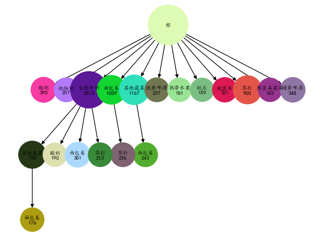
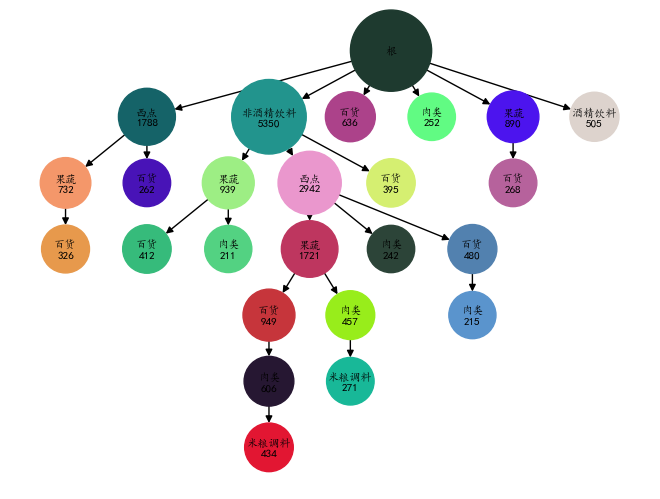

```python
import pandas as pd
import numpy as np
import FP_tree as fp
import matplotlib.pyplot as plt
import matplotlib as mpl
import copy
```


```python
data1 = pd.read_csv("GoodsOrder.csv",encoding = 'gbk')
data2 = pd.read_csv("GoodsTypes.csv",encoding = 'gbk')
```


```python
def get_list(orderlist):
     return [   item for item in orderlist]
     
order_lists = data1.groupby("id").agg(lambda x:get_list(x))
order_lists.head()
```


<div>
<style scoped>
    .dataframe tbody tr th:only-of-type {
        vertical-align: middle;
    }

    .dataframe tbody tr th {
        vertical-align: top;
    }

    .dataframe thead th {
        text-align: right;
    }
</style>
<table border="1" class="dataframe">
  <thead>
    <tr style="text-align: right;">
      <th></th>
      <th>Goods</th>
    </tr>
    <tr>
      <th>id</th>
      <th></th>
    </tr>
  </thead>
  <tbody>
    <tr>
      <th>1</th>
      <td>[柑橘类水果, 人造黄油, 即食汤, 半成品面包]</td>
    </tr>
    <tr>
      <th>2</th>
      <td>[咖啡, 热带水果, 酸奶]</td>
    </tr>
    <tr>
      <th>3</th>
      <td>[全脂牛奶]</td>
    </tr>
    <tr>
      <th>4</th>
      <td>[奶油乳酪, 肉泥, 仁果类水果, 酸奶]</td>
    </tr>
    <tr>
      <th>5</th>
      <td>[炼乳, 长面包, 其他蔬菜, 全脂牛奶]</td>
    </tr>
  </tbody>
</table>
</div>


```python
data = list(order_lists.Goods)
data[:5]
```


    [['柑橘类水果', '人造黄油', '即食汤', '半成品面包'],
     ['咖啡', '热带水果', '酸奶'],
     ['全脂牛奶'],
     ['奶油乳酪', '肉泥', '仁果类水果', '酸奶'],
     ['炼乳', '长面包', '其他蔬菜', '全脂牛奶']]


## 最小支持度=0.1 分析


```python
tree = fp.FP_Tree(0.01)
tree.fit(data)
```


```python
tree.show(node_num = 20)
```


    

    


```python
tree.get_rules(0.3)
```


    [(frozenset({'硬奶酪'}), frozenset({'全脂牛奶'}), 0.4107883817427386),
     (frozenset({'洋葱'}), frozenset({'其他蔬菜'}), 0.45901639344262296),
     (frozenset({'糖'}), frozenset({'其他蔬菜'}), 0.3183183183183183),
     (frozenset({'人造黄油'}), frozenset({'其他蔬菜'}), 0.3368055555555556),
     (frozenset({'酸奶油'}), frozenset({'其他蔬菜'}), 0.40283687943262414),
     (frozenset({'牛肉'}), frozenset({'全脂牛奶'}), 0.4050387596899225),
     (frozenset({'冷冻蔬菜'}), frozenset({'全脂牛奶'}), 0.4249471458773784),
     (frozenset({'甜点'}), frozenset({'其他蔬菜'}), 0.31232876712328766),
     (frozenset({'人造黄油'}), frozenset({'全脂牛奶'}), 0.4131944444444444),
     (frozenset({'鸡'}), frozenset({'其他蔬菜'}), 0.41706161137440756),
     (frozenset({'长面包'}), frozenset({'全脂牛奶'}), 0.36141304347826086),
     (frozenset({'凝乳'}), frozenset({'酸奶'}), 0.3244274809160305),
     (frozenset({'本地蛋类'}), frozenset({'其他蔬菜'}), 0.35096153846153844),
     (frozenset({'火腿'}), frozenset({'全脂牛奶'}), 0.44140625),
     (frozenset({'冷冻热狗肠'}), frozenset({'面包卷'}), 0.3258620689655172),
     (frozenset({'猪肉'}), frozenset({'其他蔬菜'}), 0.37566137566137564),
     (frozenset({'瓶装水'}), frozenset({'全脂牛奶'}), 0.3109475620975161),
     (frozenset({'本地蛋类'}), frozenset({'全脂牛奶'}), 0.47275641025641024),
     (frozenset({'酸奶'}), frozenset({'其他蔬菜'}), 0.3112244897959184),
     (frozenset({'黑面包'}), frozenset({'全脂牛奶'}), 0.3887147335423197),
     (frozenset({'香肠'}), frozenset({'面包卷'}), 0.32575757575757575),
     (frozenset({'汉堡肉'}), frozenset({'全脂牛奶'}), 0.4434250764525994),
     (frozenset({'黄油'}), frozenset({'全脂牛奶'}), 0.4972477064220184),
     (frozenset({'水果/蔬菜汁'}), frozenset({'全脂牛奶'}), 0.36849507735583686),
     (frozenset({'酸奶油'}), frozenset({'全脂牛奶'}), 0.44964539007092197),
     (frozenset({'仁果类水果'}), frozenset({'全脂牛奶'}), 0.3978494623655914),
     (frozenset({'酪'}), frozenset({'其他蔬菜'}), 0.3709090909090909),
     (frozenset({'柑橘类水果'}), frozenset({'其他蔬菜'}), 0.3488943488943489),
     (frozenset({'冷冻热狗肠'}), frozenset({'全脂牛奶'}), 0.3482758620689655),
     (frozenset({'莓果'}), frozenset({'酸奶'}), 0.3180428134556575),
     (frozenset({'凝乳'}), frozenset({'其他蔬菜'}), 0.32251908396946566),
     (frozenset({'热带水果'}), frozenset({'其他蔬菜'}), 0.34205426356589147),
     (frozenset({'白面包'}), frozenset({'全脂牛奶'}), 0.4057971014492754),
     (frozenset({'香肠'}), frozenset({'全脂牛奶'}), 0.3181818181818182),
     (frozenset({'奶油乳酪'}), frozenset({'全脂牛奶'}), 0.4153846153846154),
     (frozenset({'酸奶'}), frozenset({'全脂牛奶'}), 0.40160349854227406),
     (frozenset({'其他蔬菜'}), frozenset({'全脂牛奶'}), 0.38675775091960063),
     (frozenset({'酪'}), frozenset({'全脂牛奶'}), 0.41454545454545455),
     (frozenset({'卫生用品'}), frozenset({'全脂牛奶'}), 0.3888888888888889),
     (frozenset({'柑橘类水果'}), frozenset({'全脂牛奶'}), 0.36855036855036855),
     (frozenset({'牛肉'}), frozenset({'根茎类蔬菜'}), 0.3313953488372093),
     (frozenset({'奶油乳酪'}), frozenset({'酸奶'}), 0.3128205128205128),
     (frozenset({'冷冻蔬菜'}), frozenset({'其他蔬菜'}), 0.3699788583509514),
     (frozenset({'莓果'}), frozenset({'全脂牛奶'}), 0.3547400611620795),
     (frozenset({'洋葱'}), frozenset({'全脂牛奶'}), 0.3901639344262295),
     (frozenset({'根茎类蔬菜'}), frozenset({'全脂牛奶'}), 0.44869402985074625),
     (frozenset({'热带水果'}), frozenset({'全脂牛奶'}), 0.40310077519379844),
     (frozenset({'凝乳'}), frozenset({'全脂牛奶'}), 0.4904580152671756),
     (frozenset({'白面包'}), frozenset({'其他蔬菜'}), 0.32608695652173914),
     (frozenset({'切片奶酪'}), frozenset({'全脂牛奶'}), 0.43983402489626555),
     (frozenset({'奶油乳酪'}), frozenset({'其他蔬菜'}), 0.34615384615384615),
     (frozenset({'报纸'}), frozenset({'全脂牛奶'}), 0.34267515923566877),
     (frozenset({'巧克力'}), frozenset({'全脂牛奶'}), 0.3360655737704918),
     (frozenset({'油'}), frozenset({'全脂牛奶'}), 0.40217391304347827),
     (frozenset({'汉堡肉'}), frozenset({'其他蔬菜'}), 0.41590214067278286),
     (frozenset({'牛肉'}), frozenset({'其他蔬菜'}), 0.375968992248062),
     (frozenset({'黄油'}), frozenset({'其他蔬菜'}), 0.3614678899082569),
     (frozenset({'鸡'}), frozenset({'全脂牛奶'}), 0.4099526066350711),
     (frozenset({'甜点'}), frozenset({'全脂牛奶'}), 0.3698630136986301),
     (frozenset({'仁果类水果'}), frozenset({'其他蔬菜'}), 0.34543010752688175),
     (frozenset({'餐巾'}), frozenset({'全脂牛奶'}), 0.3766990291262136),
     (frozenset({'莓果'}), frozenset({'其他蔬菜'}), 0.308868501529052),
     (frozenset({'根茎类蔬菜'}), frozenset({'其他蔬菜'}), 0.43470149253731344),
     (frozenset({'面包卷'}), frozenset({'全脂牛奶'}), 0.30790491984521834),
     (frozenset({'猪肉'}), frozenset({'全脂牛奶'}), 0.3844797178130511),
     (frozenset({'糕点'}), frozenset({'全脂牛奶'}), 0.3737142857142857),
     (frozenset({'糖'}), frozenset({'全脂牛奶'}), 0.4444444444444444),
     (frozenset({'威化饼'}), frozenset({'全脂牛奶'}), 0.3306878306878307),
     (frozenset({'咖啡'}), frozenset({'全脂牛奶'}), 0.3222416812609457),
     (frozenset({'根茎类蔬菜', '面包卷'}), frozenset({'其他蔬菜'}), 0.502092050209205),
     (frozenset({'根茎类蔬菜', '酸奶'}), frozenset({'其他蔬菜'}), 0.5),
     (frozenset({'其他蔬菜', '糕点'}), frozenset({'全脂牛奶'}), 0.46846846846846846),
     (frozenset({'全脂牛奶', '糕点'}), frozenset({'其他蔬菜'}), 0.3180428134556575),
     (frozenset({'其他蔬菜', '瓶装水'}), frozenset({'全脂牛奶'}), 0.4344262295081967),
     (frozenset({'全脂牛奶', '瓶装水'}), frozenset({'其他蔬菜'}), 0.3136094674556213),
     (frozenset({'其他蔬菜', '香肠'}), frozenset({'全脂牛奶'}), 0.37735849056603776),
     (frozenset({'全脂牛奶', '香肠'}), frozenset({'其他蔬菜'}), 0.3401360544217687),
     (frozenset({'根茎类蔬菜', '酸奶'}), frozenset({'全脂牛奶'}), 0.562992125984252),
     (frozenset({'其他蔬菜', '本地蛋类'}), frozenset({'全脂牛奶'}), 0.5525114155251142),
     (frozenset({'全脂牛奶', '本地蛋类'}), frozenset({'其他蔬菜'}), 0.4101694915254237),
     (frozenset({'热带水果', '酸奶'}), frozenset({'全脂牛奶'}), 0.5173611111111112),
     (frozenset({'全脂牛奶', '热带水果'}), frozenset({'酸奶'}), 0.3581730769230769),
     (frozenset({'热带水果', '酸奶'}), frozenset({'其他蔬菜'}), 0.4201388888888889),
     (frozenset({'其他蔬菜', '热带水果'}), frozenset({'酸奶'}), 0.34277620396600567),
     (frozenset({'苏打', '酸奶'}), frozenset({'全脂牛奶'}), 0.3828996282527881),
     (frozenset({'其他蔬菜', '面包卷'}), frozenset({'全脂牛奶'}), 0.4200477326968974),
     (frozenset({'全脂牛奶', '面包卷'}), frozenset({'其他蔬菜'}), 0.31597845601436264),
     (frozenset({'其他蔬菜', '热带水果'}), frozenset({'全脂牛奶'}), 0.47592067988668557),
     (frozenset({'全脂牛奶', '热带水果'}), frozenset({'其他蔬菜'}), 0.40384615384615385),
     (frozenset({'仁果类水果', '其他蔬菜'}), frozenset({'全脂牛奶'}), 0.5175097276264592),
     (frozenset({'仁果类水果', '全脂牛奶'}), frozenset({'其他蔬菜'}), 0.44932432432432434),
     (frozenset({'柑橘类水果', '酸奶'}), frozenset({'全脂牛奶'}), 0.47417840375586856),
     (frozenset({'全脂牛奶', '柑橘类水果'}), frozenset({'酸奶'}), 0.33666666666666667),
     (frozenset({'其他蔬菜', '根茎类蔬菜'}), frozenset({'全脂牛奶'}), 0.4892703862660944),
     (frozenset({'全脂牛奶', '根茎类蔬菜'}), frozenset({'其他蔬菜'}), 0.47401247401247404),
     (frozenset({'全脂牛奶', '其他蔬菜'}), frozenset({'根茎类蔬菜'}), 0.30978260869565216),
     (frozenset({'其他蔬菜', '柑橘类水果'}), frozenset({'全脂牛奶'}), 0.4507042253521127),
     (frozenset({'全脂牛奶', '柑橘类水果'}), frozenset({'其他蔬菜'}), 0.4266666666666667),
     (frozenset({'其他蔬菜', '水果/蔬菜汁'}), frozenset({'全脂牛奶'}), 0.4975845410628019),
     (frozenset({'全脂牛奶', '水果/蔬菜汁'}), frozenset({'其他蔬菜'}), 0.3931297709923664),
     (frozenset({'其他蔬菜', '酸奶油'}), frozenset({'全脂牛奶'}), 0.5070422535211268),
     (frozenset({'全脂牛奶', '酸奶油'}), frozenset({'其他蔬菜'}), 0.45425867507886436),
     (frozenset({'凝乳', '酸奶'}), frozenset({'全脂牛奶'}), 0.5823529411764706),
     (frozenset({'全脂牛奶', '凝乳'}), frozenset({'酸奶'}), 0.3852140077821012),
     (frozenset({'其他蔬菜', '苏打'}), frozenset({'全脂牛奶'}), 0.4254658385093168),
     (frozenset({'全脂牛奶', '苏打'}), frozenset({'其他蔬菜'}), 0.3477157360406091),
     (frozenset({'酸奶', '面包卷'}), frozenset({'全脂牛奶'}), 0.4526627218934911),
     (frozenset({'柑橘类水果', '根茎类蔬菜'}), frozenset({'其他蔬菜'}), 0.5862068965517241),
     (frozenset({'其他蔬菜', '柑橘类水果'}), frozenset({'根茎类蔬菜'}), 0.3591549295774648),
     (frozenset({'热带水果', '面包卷'}), frozenset({'全脂牛奶'}), 0.4462809917355372),
     (frozenset({'酸奶', '酸奶油'}), frozenset({'其他蔬菜'}), 0.49019607843137253),
     (frozenset({'其他蔬菜', '酸奶油'}), frozenset({'酸奶'}), 0.352112676056338),
     (frozenset({'酸奶', '酸奶油'}), frozenset({'全脂牛奶'}), 0.5245098039215687),
     (frozenset({'全脂牛奶', '酸奶油'}), frozenset({'酸奶'}), 0.33753943217665616),
     (frozenset({'其他蔬菜', '黄油'}), frozenset({'全脂牛奶'}), 0.5736040609137056),
     (frozenset({'全脂牛奶', '黄油'}), frozenset({'其他蔬菜'}), 0.41697416974169743),
     (frozenset({'其他蔬菜', '酸奶'}), frozenset({'全脂牛奶'}), 0.5128805620608899),
     (frozenset({'全脂牛奶', '酸奶'}), frozenset({'其他蔬菜'}), 0.397459165154265),
     (frozenset({'酸奶', '面包卷'}), frozenset({'其他蔬菜'}), 0.3343195266272189),
     (frozenset({'其他蔬菜', '猪肉'}), frozenset({'全脂牛奶'}), 0.4694835680751174),
     (frozenset({'全脂牛奶', '猪肉'}), frozenset({'其他蔬菜'}), 0.45871559633027525),
     (frozenset({'根茎类蔬菜', '面包卷'}), frozenset({'全脂牛奶'}), 0.5230125523012552),
     (frozenset({'根茎类蔬菜', '热带水果'}), frozenset({'全脂牛奶'}), 0.5700483091787439),
     (frozenset({'根茎类蔬菜', '热带水果'}), frozenset({'其他蔬菜'}), 0.5845410628019324),
     (frozenset({'其他蔬菜', '热带水果'}), frozenset({'根茎类蔬菜'}), 0.34277620396600567)]


## 设置的最小支持度过高


```python

tree = fp.FP_Tree(0.5)
tree.fit(data)
tree.show()
```

    ----------------------------------------------warning：----------------------------------------------------
    要保证存在事务中的item中至少存在一个item的支持度是大于支持度。否则只有一个树中只有一个根节点
    

## 按商品的分类建树


```python
get_types= {name:type_ for name,type_ in data2.values}
```


```python
data_type = copy.deepcopy(data)                          
for tras in data_type:
    for index in range(len(tras)):
        item = tras[index]
        tras[index] = get_types.get(item,item )
data_type= list(map(lambda x: list(set(x) ),  data_type)) #set排重
```


```python
tree2 = fp.FP_Tree(0.03)
tree2.fit(data_type)
tree2.show(node_num=25)
```


    

    


```python
tree2.get_rules(0)
```


    [(frozenset({'米粮调料'}), frozenset({'非酒精饮料'}), 0.6593050647820966),
     (frozenset({'非酒精饮料'}), frozenset({'米粮调料'}), 0.4185046728971963),
     (frozenset({'米粮调料'}), frozenset({'果蔬'}), 0.6127797408716137),
     (frozenset({'果蔬'}), frozenset({'米粮调料'}), 0.48598785614198975),
     (frozenset({'米粮调料'}), frozenset({'肉类'}), 0.49440518256772675),
     (frozenset({'肉类'}), frozenset({'米粮调料'}), 0.48233266302786554),
     (frozenset({'食品类'}), frozenset({'果蔬'}), 0.6307171089779785),
     (frozenset({'果蔬'}), frozenset({'食品类'}), 0.26085941148995795),
     (frozenset({'食品类'}), frozenset({'肉类'}), 0.4709203839638622),
     (frozenset({'肉类'}), frozenset({'食品类'}), 0.23958632576845734),
     (frozenset({'食品类'}), frozenset({'非酒精饮料'}), 0.6713721061547149),
     (frozenset({'非酒精饮料'}), frozenset({'食品类'}), 0.2222429906542056),
     (frozenset({'非酒精饮料'}), frozenset({'酒精饮料'}), 0.1730841121495327),
     (frozenset({'酒精饮料'}), frozenset({'非酒精饮料'}), 0.46509291813159215),
     (frozenset({'食品类'}), frozenset({'零食'}), 0.16883116883116883),
     (frozenset({'零食'}), frozenset({'食品类'}), 0.22929447852760737),
     (frozenset({'西点'}), frozenset({'米粮调料'}), 0.4310782241014799),
     (frozenset({'米粮调料'}), frozenset({'西点'}), 0.600412249705536),
     (frozenset({'零食'}), frozenset({'非酒精饮料'}), 0.6050613496932515),
     (frozenset({'非酒精饮料'}), frozenset({'零食'}), 0.14747663551401868),
     (frozenset({'百货'}), frozenset({'非酒精饮料'}), 0.5997854077253219),
     (frozenset({'非酒精饮料'}), frozenset({'百货'}), 0.4179439252336449),
     (frozenset({'西点'}), frozenset({'熟食'}), 0.06744186046511629),
     (frozenset({'熟食'}), frozenset({'西点'}), 0.6354581673306773),
     (frozenset({'百货'}), frozenset({'果蔬'}), 0.5244098712446352),
     (frozenset({'果蔬'}), frozenset({'百货'}), 0.45656235404016815),
     (frozenset({'百货'}), frozenset({'肉类'}), 0.4302575107296137),
     (frozenset({'肉类'}), frozenset({'百货'}), 0.46078713013501865),
     (frozenset({'西点'}), frozenset({'果蔬'}), 0.5186046511627908),
     (frozenset({'果蔬'}), frozenset({'西点'}), 0.5728631480616534),
     (frozenset({'西点'}), frozenset({'肉类'}), 0.45856236786469345),
     (frozenset({'肉类'}), frozenset({'西点'}), 0.6230968112611318),
     (frozenset({'米粮调料'}), frozenset({'食品类'}), 0.26354534746760894),
     (frozenset({'食品类'}), frozenset({'米粮调料'}), 0.5053642010163749),
     (frozenset({'西点'}), frozenset({'零食'}), 0.16046511627906976),
     (frozenset({'零食'}), frozenset({'西点'}), 0.5820552147239264),
     (frozenset({'百货'}), frozenset({'西点'}), 0.5410407725321889),
     (frozenset({'西点'}), frozenset({'百货'}), 0.42642706131078223),
     (frozenset({'非酒精饮料'}), frozenset({'熟食'}), 0.06785046728971962),
     (frozenset({'熟食'}), frozenset({'非酒精饮料'}), 0.7231075697211156),
     (frozenset({'百货'}), frozenset({'米粮调料'}), 0.44930257510729615),
     (frozenset({'米粮调料'}), frozenset({'百货'}), 0.49322732626619553),
     (frozenset({'百货'}), frozenset({'食品类'}), 0.23256437768240343),
     (frozenset({'食品类'}), frozenset({'百货'}), 0.48955392433653305),
     (frozenset({'百货'}), frozenset({'酒精饮料'}), 0.19179184549356224),
     (frozenset({'酒精饮料'}), frozenset({'百货'}), 0.35911602209944754),
     (frozenset({'米粮调料'}), frozenset({'熟食'}), 0.09010600706713781),
     (frozenset({'熟食'}), frozenset({'米粮调料'}), 0.6095617529880478),
     (frozenset({'百货'}), frozenset({'零食'}), 0.16496781115879827),
     (frozenset({'零食'}), frozenset({'百货'}), 0.47162576687116564),
     (frozenset({'果蔬'}), frozenset({'肉类'}), 0.5016347501167678),
     (frozenset({'肉类'}), frozenset({'果蔬'}), 0.6170640620511347),
     (frozenset({'果蔬'}), frozenset({'零食'}), 0.15296590378327884),
     (frozenset({'零食'}), frozenset({'果蔬'}), 0.5023006134969326),
     (frozenset({'果蔬'}), frozenset({'非酒精饮料'}), 0.6212050443717889),
     (frozenset({'非酒精饮料'}), frozenset({'果蔬'}), 0.497196261682243),
     (frozenset({'肉类'}), frozenset({'非酒精饮料'}), 0.6279804653835105),
     (frozenset({'非酒精饮料'}), frozenset({'肉类'}), 0.4085981308411215),
     (frozenset({'肉类'}), frozenset({'零食'}), 0.14909508761850043),
     (frozenset({'零食'}), frozenset({'肉类'}), 0.39800613496932513),
     (frozenset({'果蔬'}), frozenset({'酒精饮料'}), 0.16464269033162074),
     (frozenset({'酒精饮料'}), frozenset({'果蔬'}), 0.35409342039176295),
     (frozenset({'肉类'}), frozenset({'酒精饮料'}), 0.17638609594943983),
     (frozenset({'酒精饮料'}), frozenset({'肉类'}), 0.30838774485183323),
     (frozenset({'米粮调料'}), frozenset({'酒精饮料'}), 0.1687279151943463),
     (frozenset({'酒精饮料'}), frozenset({'米粮调料'}), 0.2877950778503265),
     (frozenset({'西点'}), frozenset({'非酒精饮料'}), 0.6219873150105708),
     (frozenset({'非酒精饮料'}), frozenset({'西点'}), 0.5499065420560748),
     (frozenset({'米粮调料'}), frozenset({'零食'}), 0.160188457008245),
     (frozenset({'零食'}), frozenset({'米粮调料'}), 0.4171779141104294),
     (frozenset({'西点'}), frozenset({'食品类'}), 0.23446088794926004),
     (frozenset({'食品类'}), frozenset({'西点'}), 0.6261998870694523),
     (frozenset({'西点'}), frozenset({'酒精饮料'}), 0.160676532769556),
     (frozenset({'酒精饮料'}), frozenset({'西点'}), 0.3817177297840281),
     (frozenset({'果蔬'}), frozenset({'熟食'}), 0.07846800560485755),
     (frozenset({'熟食'}), frozenset({'果蔬'}), 0.6693227091633466),
     (frozenset({'果蔬', '百货'}), frozenset({'肉类'}), 0.5739130434782609),
     (frozenset({'百货', '肉类'}), frozenset({'果蔬'}), 0.699501246882793),
     (frozenset({'果蔬', '肉类'}), frozenset({'百货'}), 0.5223463687150838),
     (frozenset({'肉类'}), frozenset({'果蔬', '百货'}), 0.32232117207698935),
     (frozenset({'果蔬'}), frozenset({'百货', '肉类'}), 0.26202709014479214),
     (frozenset({'百货'}), frozenset({'果蔬', '肉类'}), 0.3009656652360515),
     (frozenset({'果蔬', '西点'}), frozenset({'酒精饮料'}), 0.16673461068079903),
     (frozenset({'西点', '酒精饮料'}), frozenset({'果蔬'}), 0.5381578947368421),
     (frozenset({'果蔬', '酒精饮料'}), frozenset({'西点'}), 0.5801418439716312),
     (frozenset({'酒精饮料'}), frozenset({'果蔬', '西点'}), 0.20542440984429935),
     (frozenset({'西点'}), frozenset({'果蔬', '酒精饮料'}), 0.08646934460887949),
     (frozenset({'果蔬'}), frozenset({'西点', '酒精饮料'}), 0.09551611396543672),
     (frozenset({'肉类', '西点'}), frozenset({'酒精饮料'}), 0.1682803135085293),
     (frozenset({'西点', '酒精饮料'}), frozenset({'肉类'}), 0.48026315789473684),
     (frozenset({'肉类', '酒精饮料'}), frozenset({'西点'}), 0.5944625407166124),
     (frozenset({'酒精饮料'}), frozenset({'肉类', '西点'}), 0.1833249623304872),
     (frozenset({'西点'}), frozenset({'肉类', '酒精饮料'}), 0.07716701902748414),
     (frozenset({'肉类'}), frozenset({'西点', '酒精饮料'}), 0.10485492674518816),
     (frozenset({'西点', '食品类'}), frozenset({'果蔬'}), 0.7060414788097386),
     (frozenset({'果蔬', '西点'}), frozenset({'食品类'}), 0.3192009783938035),
     (frozenset({'果蔬', '食品类'}), frozenset({'西点'}), 0.7009847806624888),
     (frozenset({'西点'}), frozenset({'果蔬', '食品类'}), 0.16553911205073996),
     (frozenset({'食品类'}), frozenset({'果蔬', '西点'}), 0.44212309429700736),
     (frozenset({'果蔬'}), frozenset({'西点', '食品类'}), 0.1828584773470341),
     (frozenset({'西点', '食品类'}), frozenset({'肉类'}), 0.5716862037871957),
     (frozenset({'肉类', '西点'}), frozenset({'食品类'}), 0.2923005993545413),
     (frozenset({'肉类', '食品类'}), frozenset({'西点'}), 0.7601918465227818),
     (frozenset({'西点'}), frozenset({'肉类', '食品类'}), 0.13403805496828752),
     (frozenset({'食品类'}), frozenset({'肉类', '西点'}), 0.3579898362507058),
     (frozenset({'肉类'}), frozenset({'西点', '食品类'}), 0.18213157138753233),
     (frozenset({'果蔬', '百货'}), frozenset({'非酒精饮料'}), 0.6961636828644501),
     (frozenset({'百货', '非酒精饮料'}), frozenset({'果蔬'}), 0.6086762075134168),
     (frozenset({'果蔬', '非酒精饮料'}), frozenset({'百货'}), 0.5116541353383459),
     (frozenset({'果蔬'}), frozenset({'百货', '非酒精饮料'}), 0.3178421298458664),
     (frozenset({'非酒精饮料'}), frozenset({'果蔬', '百货'}), 0.254392523364486),
     (frozenset({'百货'}), frozenset({'果蔬', '非酒精饮料'}), 0.36507510729613735),
     (frozenset({'百货', '肉类'}), frozenset({'非酒精饮料'}), 0.6988778054862843),
     (frozenset({'百货', '非酒精饮料'}), frozenset({'肉类'}), 0.5013416815742398),
     (frozenset({'肉类', '非酒精饮料'}), frozenset({'百货'}), 0.5128087831655993),
     (frozenset({'肉类'}), frozenset({'百货', '非酒精饮料'}), 0.3220338983050847),
     (frozenset({'非酒精饮料'}), frozenset({'百货', '肉类'}), 0.20953271028037382),
     (frozenset({'百货'}), frozenset({'肉类', '非酒精饮料'}), 0.30069742489270385),
     (frozenset({'米粮调料', '肉类'}), frozenset({'零食'}), 0.1917808219178082),
     (frozenset({'米粮调料', '零食'}), frozenset({'肉类'}), 0.5919117647058824),
     (frozenset({'肉类', '零食'}), frozenset({'米粮调料'}), 0.6204238921001927),
     (frozenset({'零食'}), frozenset({'米粮调料', '肉类'}), 0.2469325153374233),
     (frozenset({'米粮调料'}), frozenset({'肉类', '零食'}), 0.09481743227326266),
     (frozenset({'肉类'}), frozenset({'米粮调料', '零食'}), 0.09250215455328928),
     (frozenset({'米粮调料', '肉类'}), frozenset({'酒精饮料'}), 0.18463371054198927),
     (frozenset({'米粮调料', '酒精饮料'}), frozenset({'肉类'}), 0.5410122164048866),
     (frozenset({'肉类', '酒精饮料'}), frozenset({'米粮调料'}), 0.504885993485342),
     (frozenset({'酒精饮料'}), frozenset({'米粮调料', '肉类'}), 0.155700652938222),
     (frozenset({'米粮调料'}), frozenset({'肉类', '酒精饮料'}), 0.09128386336866902),
     (frozenset({'肉类'}), frozenset({'米粮调料', '酒精饮料'}), 0.08905486929043378),
     (frozenset({'果蔬', '米粮调料'}), frozenset({'酒精饮料'}), 0.17779913503123498),
     (frozenset({'米粮调料', '酒精饮料'}), frozenset({'果蔬'}), 0.6457242582897034),
     (frozenset({'果蔬', '酒精饮料'}), frozenset({'米粮调料'}), 0.524822695035461),
     (frozenset({'酒精饮料'}), frozenset({'果蔬', '米粮调料'}), 0.18583626318432947),
     (frozenset({'米粮调料'}), frozenset({'果蔬', '酒精饮料'}), 0.10895170789163722),
     (frozenset({'果蔬'}), frozenset({'米粮调料', '酒精饮料'}), 0.08640822045773003),
     (frozenset({'果蔬', '米粮调料'}), frozenset({'零食'}), 0.17635752042287361),
     (frozenset({'米粮调料', '零食'}), frozenset({'果蔬'}), 0.6746323529411765),
     (frozenset({'果蔬', '零食'}), frozenset({'米粮调料'}), 0.5603053435114503),
     (frozenset({'零食'}), frozenset({'果蔬', '米粮调料'}), 0.28144171779141103),
     (frozenset({'米粮调料'}), frozenset({'果蔬', '零食'}), 0.10806831566548881),
     (frozenset({'果蔬'}), frozenset({'米粮调料', '零食'}), 0.08570761326482952),
     (frozenset({'果蔬', '西点'}), frozenset({'非酒精饮料'}), 0.7015898899306972),
     (frozenset({'西点', '非酒精饮料'}), frozenset({'果蔬'}), 0.5849762066621346),
     (frozenset({'果蔬', '非酒精饮料'}), frozenset({'西点'}), 0.6469924812030076),
     (frozenset({'非酒精饮料'}), frozenset({'果蔬', '西点'}), 0.32168224299065423),
     (frozenset({'西点'}), frozenset({'果蔬', '非酒精饮料'}), 0.3638477801268499),
     (frozenset({'果蔬'}), frozenset({'西点', '非酒精饮料'}), 0.4019149929939281),
     (frozenset({'肉类', '西点'}), frozenset({'非酒精饮料'}), 0.7007837713231904),
     (frozenset({'西点', '非酒精饮料'}), frozenset({'肉类'}), 0.5166553365057783),
     (frozenset({'肉类', '非酒精饮料'}), frozenset({'西点'}), 0.6953339432753889),
     (frozenset({'非酒精饮料'}), frozenset({'肉类', '西点'}), 0.2841121495327103),
     (frozenset({'西点'}), frozenset({'肉类', '非酒精饮料'}), 0.321353065539112),
     (frozenset({'肉类'}), frozenset({'西点', '非酒精饮料'}), 0.43665613329503017),
     (frozenset({'百货', '米粮调料'}), frozenset({'食品类'}), 0.31522388059701495),
     (frozenset({'百货', '食品类'}), frozenset({'米粮调料'}), 0.6089965397923875),
     (frozenset({'米粮调料', '食品类'}), frozenset({'百货'}), 0.5899441340782123),
     (frozenset({'百货'}), frozenset({'米粮调料', '食品类'}), 0.14163090128755365),
     (frozenset({'食品类'}), frozenset({'百货', '米粮调料'}), 0.2981366459627329),
     (frozenset({'米粮调料'}), frozenset({'百货', '食品类'}), 0.15547703180212014),
     (frozenset({'百货', '米粮调料'}), frozenset({'酒精饮料'}), 0.19044776119402984),
     (frozenset({'百货', '酒精饮料'}), frozenset({'米粮调料'}), 0.4461538461538462),
     (frozenset({'米粮调料', '酒精饮料'}), frozenset({'百货'}), 0.5567190226876091),
     (frozenset({'酒精饮料'}), frozenset({'百货', '米粮调料'}), 0.16022099447513813),
     (frozenset({'米粮调料'}), frozenset({'百货', '酒精饮料'}), 0.09393404004711425),
     (frozenset({'百货'}), frozenset({'米粮调料', '酒精饮料'}), 0.08556866952789699),
     (frozenset({'百货', '西点'}), frozenset({'非酒精饮料'}), 0.7084779375309866),
     (frozenset({'百货', '非酒精饮料'}), frozenset({'西点'}), 0.639087656529517),
     (frozenset({'西点', '非酒精饮料'}), frozenset({'百货'}), 0.4857239972807614),
     (frozenset({'西点'}), frozenset({'百货', '非酒精饮料'}), 0.3021141649048626),
     (frozenset({'非酒精饮料'}), frozenset({'百货', '西点'}), 0.26710280373831774),
     (frozenset({'百货'}), frozenset({'西点', '非酒精饮料'}), 0.3833154506437768),
     (frozenset({'米粮调料', '西点'}), frozenset({'食品类'}), 0.31338891613536046),
     (frozenset({'西点', '食品类'}), frozenset({'米粮调料'}), 0.5761947700631199),
     (frozenset({'米粮调料', '食品类'}), frozenset({'西点'}), 0.7139664804469273),
     (frozenset({'食品类'}), frozenset({'米粮调料', '西点'}), 0.3608130999435347),
     (frozenset({'西点'}), frozenset({'米粮调料', '食品类'}), 0.13509513742071882),
     (frozenset({'米粮调料'}), frozenset({'西点', '食品类'}), 0.1881625441696113),
     (frozenset({'百货', '米粮调料'}), frozenset({'零食'}), 0.19522388059701493),
     (frozenset({'百货', '零食'}), frozenset({'米粮调料'}), 0.5317073170731708),
     (frozenset({'米粮调料', '零食'}), frozenset({'百货'}), 0.6011029411764706),
     (frozenset({'零食'}), frozenset({'百货', '米粮调料'}), 0.25076687116564417),
     (frozenset({'米粮调料'}), frozenset({'百货', '零食'}), 0.09628975265017668),
     (frozenset({'百货'}), frozenset({'米粮调料', '零食'}), 0.08771459227467811),
     (frozenset({'米粮调料', '西点'}), frozenset({'酒精饮料'}), 0.17704757233938204),
     (frozenset({'西点', '酒精饮料'}), frozenset({'米粮调料'}), 0.475),
     (frozenset({'米粮调料', '酒精饮料'}), frozenset({'西点'}), 0.6300174520069808),
     (frozenset({'酒精饮料'}), frozenset({'米粮调料', '西点'}), 0.18131592164741336),
     (frozenset({'西点'}), frozenset({'米粮调料', '酒精饮料'}), 0.07632135306553911),
     (frozenset({'米粮调料'}), frozenset({'西点', '酒精饮料'}), 0.106301531213192),
     (frozenset({'果蔬', '米粮调料'}), frozenset({'肉类'}), 0.5953868332532436),
     (frozenset({'米粮调料', '肉类'}), frozenset({'果蔬'}), 0.7379392495533056),
     (frozenset({'果蔬', '肉类'}), frozenset({'米粮调料'}), 0.5768156424581006),
     (frozenset({'肉类'}), frozenset({'果蔬', '米粮调料'}), 0.3559322033898305),
     (frozenset({'果蔬'}), frozenset({'米粮调料', '肉类'}), 0.2893507706679122),
     (frozenset({'米粮调料'}), frozenset({'果蔬', '肉类'}), 0.36484098939929327),
     (frozenset({'百货', '肉类'}), frozenset({'零食'}), 0.192643391521197),
     (frozenset({'百货', '零食'}), frozenset({'肉类'}), 0.5024390243902439),
     (frozenset({'肉类', '零食'}), frozenset({'百货'}), 0.5953757225433526),
     (frozenset({'零食'}), frozenset({'百货', '肉类'}), 0.23696319018404907),
     (frozenset({'肉类'}), frozenset({'百货', '零食'}), 0.08876759551852915),
     (frozenset({'百货'}), frozenset({'肉类', '零食'}), 0.0828862660944206),
     (frozenset({'果蔬', '百货'}), frozenset({'零食'}), 0.1959079283887468),
     (frozenset({'百货', '零食'}), frozenset({'果蔬'}), 0.6227642276422765),
     (frozenset({'果蔬', '零食'}), frozenset({'百货'}), 0.5847328244274809),
     (frozenset({'零食'}), frozenset({'果蔬', '百货'}), 0.2937116564417178),
     (frozenset({'果蔬'}), frozenset({'百货', '零食'}), 0.08944418496029892),
     (frozenset({'百货'}), frozenset({'果蔬', '零食'}), 0.10273605150214592),
     (frozenset({'果蔬', '米粮调料'}), frozenset({'非酒精饮料'}), 0.7184046131667468),
     (frozenset({'米粮调料', '非酒精饮料'}), frozenset({'果蔬'}), 0.6677087985707906),
     (frozenset({'果蔬', '非酒精饮料'}), frozenset({'米粮调料'}), 0.5620300751879699),
     (frozenset({'果蔬'}), frozenset({'米粮调料', '非酒精饮料'}), 0.3491359177954227),
     (frozenset({'非酒精饮料'}), frozenset({'果蔬', '米粮调料'}), 0.2794392523364486),
     (frozenset({'米粮调料'}), frozenset({'果蔬', '非酒精饮料'}), 0.44022379269729095),
     (frozenset({'米粮调料', '肉类'}), frozenset({'非酒精饮料'}), 0.7307921381774866),
     (frozenset({'米粮调料', '非酒精饮料'}), frozenset({'肉类'}), 0.5480125055828495),
     (frozenset({'肉类', '非酒精饮料'}), frozenset({'米粮调料'}), 0.561299176578225),
     (frozenset({'肉类'}), frozenset({'米粮调料', '非酒精饮料'}), 0.352484918126975),
     (frozenset({'非酒精饮料'}), frozenset({'米粮调料', '肉类'}), 0.22934579439252337),
     (frozenset({'米粮调料'}), frozenset({'肉类', '非酒精饮料'}), 0.36130742049469966),
     (frozenset({'果蔬', '百货'}), frozenset({'酒精饮料'}), 0.1948849104859335),
     (frozenset({'百货', '酒精饮料'}), frozenset({'果蔬'}), 0.5328671328671328),
     (frozenset({'果蔬', '酒精饮料'}), frozenset({'百货'}), 0.5404255319148936),
     (frozenset({'酒精饮料'}), frozenset({'果蔬', '百货'}), 0.19136112506278252),
     (frozenset({'果蔬'}), frozenset({'百货', '酒精饮料'}), 0.08897711349836525),
     (frozenset({'百货'}), frozenset({'果蔬', '酒精饮料'}), 0.10219957081545064),
     (frozenset({'百货', '肉类'}), frozenset({'酒精饮料'}), 0.20324189526184538),
     (frozenset({'百货', '酒精饮料'}), frozenset({'肉类'}), 0.45594405594405596),
     (frozenset({'肉类', '酒精饮料'}), frozenset({'百货'}), 0.5309446254071661),
     (frozenset({'酒精饮料'}), frozenset({'百货', '肉类'}), 0.16373681567051732),
     (frozenset({'肉类'}), frozenset({'百货', '酒精饮料'}), 0.09365124964090779),
     (frozenset({'百货'}), frozenset({'肉类', '酒精饮料'}), 0.08744635193133048),
     (frozenset({'百货', '食品类'}), frozenset({'肉类'}), 0.5432525951557093),
     (frozenset({'百货', '肉类'}), frozenset({'食品类'}), 0.293640897755611),
     (frozenset({'肉类', '食品类'}), frozenset({'百货'}), 0.564748201438849),
     (frozenset({'百货'}), frozenset({'肉类', '食品类'}), 0.1263412017167382),
     (frozenset({'食品类'}), frozenset({'百货', '肉类'}), 0.26595143986448333),
     (frozenset({'肉类'}), frozenset({'百货', '食品类'}), 0.13530594656707842),
     (frozenset({'百货', '食品类'}), frozenset({'果蔬'}), 0.7058823529411765),
     (frozenset({'果蔬', '百货'}), frozenset({'食品类'}), 0.3130434782608696),
     (frozenset({'果蔬', '食品类'}), frozenset({'百货'}), 0.5478961504028648),
     (frozenset({'百货'}), frozenset({'果蔬', '食品类'}), 0.16416309012875535),
     (frozenset({'食品类'}), frozenset({'果蔬', '百货'}), 0.3455674760022586),
     (frozenset({'果蔬'}), frozenset({'百货', '食品类'}), 0.14292386735170481),
     (frozenset({'果蔬', '肉类'}), frozenset({'酒精饮料'}), 0.17458100558659218),
     (frozenset({'果蔬', '酒精饮料'}), frozenset({'肉类'}), 0.5319148936170213),
     (frozenset({'肉类', '酒精饮料'}), frozenset({'果蔬'}), 0.6107491856677525),
     (frozenset({'酒精饮料'}), frozenset({'果蔬', '肉类'}), 0.18834756403817177),
     (frozenset({'肉类'}), frozenset({'果蔬', '酒精饮料'}), 0.10772766446423442),
     (frozenset({'果蔬'}), frozenset({'肉类', '酒精饮料'}), 0.08757589911256422),
     (frozenset({'百货', '食品类'}), frozenset({'非酒精饮料'}), 0.7497116493656286),
     (frozenset({'百货', '非酒精饮料'}), frozenset({'食品类'}), 0.29069767441860467),
     (frozenset({'非酒精饮料', '食品类'}), frozenset({'百货'}), 0.5466778805719091),
     (frozenset({'百货'}), frozenset({'非酒精饮料', '食品类'}), 0.17435622317596566),
     (frozenset({'食品类'}), frozenset({'百货', '非酒精饮料'}), 0.36702428006775834),
     (frozenset({'非酒精饮料'}), frozenset({'百货', '食品类'}), 0.12149532710280374),
     (frozenset({'米粮调料', '西点'}), frozenset({'非酒精饮料'}), 0.7248651299656694),
     (frozenset({'西点', '非酒精饮料'}), frozenset({'米粮调料'}), 0.5023793337865398),
     (frozenset({'米粮调料', '非酒精饮料'}), frozenset({'西点'}), 0.6601161232693167),
     (frozenset({'西点'}), frozenset({'米粮调料', '非酒精饮料'}), 0.3124735729386892),
     (frozenset({'非酒精饮料'}), frozenset({'米粮调料', '西点'}), 0.27626168224299064),
     (frozenset({'米粮调料'}), frozenset({'西点', '非酒精饮料'}), 0.43521790341578326),
     (frozenset({'果蔬', '肉类'}), frozenset({'零食'}), 0.17458100558659218),
     (frozenset({'果蔬', '零食'}), frozenset({'肉类'}), 0.5725190839694656),
     (frozenset({'肉类', '零食'}), frozenset({'果蔬'}), 0.7225433526011561),
     (frozenset({'零食'}), frozenset({'果蔬', '肉类'}), 0.2875766871165644),
     (frozenset({'肉类'}), frozenset({'果蔬', '零食'}), 0.10772766446423442),
     (frozenset({'果蔬'}), frozenset({'肉类', '零食'}), 0.08757589911256422),
     (frozenset({'百货', '西点'}), frozenset({'酒精饮料'}), 0.1789786812097174),
     (frozenset({'百货', '酒精饮料'}), frozenset({'西点'}), 0.5048951048951049),
     (frozenset({'西点', '酒精饮料'}), frozenset({'百货'}), 0.475),
     (frozenset({'酒精饮料'}), frozenset({'百货', '西点'}), 0.18131592164741336),
     (frozenset({'西点'}), frozenset({'百货', '酒精饮料'}), 0.07632135306553911),
     (frozenset({'百货'}), frozenset({'西点', '酒精饮料'}), 0.09683476394849785),
     (frozenset({'果蔬', '肉类'}), frozenset({'非酒精饮料'}), 0.6899441340782123),
     (frozenset({'果蔬', '非酒精饮料'}), frozenset({'肉类'}), 0.5571428571428572),
     (frozenset({'肉类', '非酒精饮料'}), frozenset({'果蔬'}), 0.6779505946935042),
     (frozenset({'非酒精饮料'}), frozenset({'果蔬', '肉类'}), 0.2770093457943925),
     (frozenset({'肉类'}), frozenset({'果蔬', '非酒精饮料'}), 0.4257397299626544),
     (frozenset({'果蔬'}), frozenset({'肉类', '非酒精饮料'}), 0.3460999532928538),
     (frozenset({'米粮调料', '食品类'}), frozenset({'果蔬'}), 0.753072625698324),
     (frozenset({'果蔬', '米粮调料'}), frozenset({'食品类'}), 0.32388274867851996),
     (frozenset({'果蔬', '食品类'}), frozenset({'米粮调料'}), 0.603401969561325),
     (frozenset({'食品类'}), frozenset({'果蔬', '米粮调料'}), 0.3805759457933371),
     (frozenset({'米粮调料'}), frozenset({'果蔬', '食品类'}), 0.19846878680800942),
     (frozenset({'果蔬'}), frozenset({'米粮调料', '食品类'}), 0.15740308267164876),
     (frozenset({'米粮调料', '食品类'}), frozenset({'肉类'}), 0.5843575418994413),
     (frozenset({'米粮调料', '肉类'}), frozenset({'食品类'}), 0.31149493746277546),
     (frozenset({'肉类', '食品类'}), frozenset({'米粮调料'}), 0.6270983213429256),
     (frozenset({'食品类'}), frozenset({'米粮调料', '肉类'}), 0.295313382269904),
     (frozenset({'米粮调料'}), frozenset({'肉类', '食品类'}), 0.15400471142520614),
     (frozenset({'肉类'}), frozenset({'米粮调料', '食品类'}), 0.15024418270611894),
     (frozenset({'果蔬', '西点'}), frozenset({'零食'}), 0.1871178149205055),
     (frozenset({'西点', '零食'}), frozenset({'果蔬'}), 0.6047430830039525),
     (frozenset({'果蔬', '零食'}), frozenset({'西点'}), 0.7007633587786259),
     (frozenset({'零食'}), frozenset({'果蔬', '西点'}), 0.35199386503067487),
     (frozenset({'果蔬'}), frozenset({'西点', '零食'}), 0.10719290051377861),
     (frozenset({'西点'}), frozenset({'果蔬', '零食'}), 0.09704016913319238),
     (frozenset({'肉类', '西点'}), frozenset({'零食'}), 0.18579990779160904),
     (frozenset({'西点', '零食'}), frozenset({'肉类'}), 0.530961791831357),
     (frozenset({'肉类', '零食'}), frozenset({'西点'}), 0.7764932562620424),
     (frozenset({'零食'}), frozenset({'肉类', '西点'}), 0.3090490797546012),
     (frozenset({'肉类'}), frozenset({'西点', '零食'}), 0.11577133007756392),
     (frozenset({'西点'}), frozenset({'肉类', '零食'}), 0.08520084566596195),
     (frozenset({'米粮调料', '食品类'}), frozenset({'非酒精饮料'}), 0.7787709497206704),
     (frozenset({'米粮调料', '非酒精饮料'}), frozenset({'食品类'}), 0.3112996873604288),
     (frozenset({'非酒精饮料', '食品类'}), frozenset({'米粮调料'}), 0.5862068965517241),
     (frozenset({'食品类'}), frozenset({'米粮调料', '非酒精饮料'}), 0.3935629587803501),
     (frozenset({'米粮调料'}), frozenset({'非酒精饮料', '食品类'}), 0.20524146054181389),
     (frozenset({'非酒精饮料'}), frozenset({'米粮调料', '食品类'}), 0.1302803738317757),
     (frozenset({'西点', '零食'}), frozenset({'非酒精饮料'}), 0.7101449275362319),
     (frozenset({'西点', '非酒精饮料'}), frozenset({'零食'}), 0.1832087015635622),
     (frozenset({'零食', '非酒精饮料'}), frozenset({'西点'}), 0.6831432192648923),
     (frozenset({'西点'}), frozenset({'零食', '非酒精饮料'}), 0.11395348837209303),
     (frozenset({'非酒精饮料'}), frozenset({'西点', '零食'}), 0.10074766355140187),
     (frozenset({'零食'}), frozenset({'西点', '非酒精饮料'}), 0.4133435582822086),
     (frozenset({'米粮调料', '非酒精饮料'}), frozenset({'酒精饮料'}), 0.17909781152300133),
     (frozenset({'米粮调料', '酒精饮料'}), frozenset({'非酒精饮料'}), 0.699825479930192),
     (frozenset({'酒精饮料', '非酒精饮料'}), frozenset({'米粮调料'}), 0.4330453563714903),
     (frozenset({'酒精饮料'}), frozenset({'米粮调料', '非酒精饮料'}), 0.20140632847815168),
     (frozenset({'米粮调料'}), frozenset({'酒精饮料', '非酒精饮料'}), 0.11808009422850413),
     (frozenset({'非酒精饮料'}), frozenset({'米粮调料', '酒精饮料'}), 0.07495327102803738),
     (frozenset({'果蔬', '西点'}), frozenset({'肉类'}), 0.5809213208316347),
     (frozenset({'肉类', '西点'}), frozenset({'果蔬'}), 0.656984785615491),
     (frozenset({'果蔬', '肉类'}), frozenset({'西点'}), 0.6634078212290503),
     (frozenset({'肉类'}), frozenset({'果蔬', '西点'}), 0.4093651249640908),
     (frozenset({'果蔬'}), frozenset({'肉类', '西点'}), 0.33278841662774405),
     (frozenset({'西点'}), frozenset({'果蔬', '肉类'}), 0.3012684989429176),
     (frozenset({'米粮调料', '零食'}), frozenset({'非酒精饮料'}), 0.7334558823529411),
     (frozenset({'米粮调料', '非酒精饮料'}), frozenset({'零食'}), 0.1782045556051809),
     (frozenset({'零食', '非酒精饮料'}), frozenset({'米粮调料'}), 0.5057034220532319),
     (frozenset({'零食'}), frozenset({'米粮调料', '非酒精饮料'}), 0.30598159509202455),
     (frozenset({'米粮调料'}), frozenset({'零食', '非酒精饮料'}), 0.11749116607773852),
     (frozenset({'非酒精饮料'}), frozenset({'米粮调料', '零食'}), 0.07457943925233645),
     (frozenset({'西点', '食品类'}), frozenset({'非酒精饮料'}), 0.7484220018034266),
     (frozenset({'西点', '非酒精饮料'}), frozenset({'食品类'}), 0.2821210061182869),
     (frozenset({'非酒精饮料', '食品类'}), frozenset({'西点'}), 0.6980656013456686),
     (frozenset({'西点'}), frozenset({'非酒精饮料', '食品类'}), 0.17547568710359407),
     (frozenset({'食品类'}), frozenset({'西点', '非酒精饮料'}), 0.4686617730095991),
     (frozenset({'非酒精饮料'}), frozenset({'西点', '食品类'}), 0.15514018691588785),
     (frozenset({'百货', '米粮调料'}), frozenset({'非酒精饮料'}), 0.7211940298507463),
     (frozenset({'百货', '非酒精饮料'}), frozenset({'米粮调料'}), 0.5402504472271914),
     (frozenset({'米粮调料', '非酒精饮料'}), frozenset({'百货'}), 0.5395265743635551),
     (frozenset({'百货'}), frozenset({'米粮调料', '非酒精饮料'}), 0.3240343347639485),
     (frozenset({'米粮调料'}), frozenset({'百货', '非酒精饮料'}), 0.35571260306242636),
     (frozenset({'非酒精饮料'}), frozenset({'百货', '米粮调料'}), 0.22579439252336447),
     (frozenset({'百货', '米粮调料'}), frozenset({'果蔬'}), 0.6770149253731343),
     (frozenset({'果蔬', '百货'}), frozenset({'米粮调料'}), 0.5800511508951407),
     (frozenset({'果蔬', '米粮调料'}), frozenset({'百货'}), 0.5449303219605959),
     (frozenset({'百货'}), frozenset({'果蔬', '米粮调料'}), 0.3041845493562232),
     (frozenset({'米粮调料'}), frozenset({'果蔬', '百货'}), 0.3339222614840989),
     (frozenset({'果蔬'}), frozenset({'百货', '米粮调料'}), 0.2648295189163942),
     (frozenset({'百货', '米粮调料'}), frozenset({'肉类'}), 0.5570149253731344),
     (frozenset({'百货', '肉类'}), frozenset({'米粮调料'}), 0.5816708229426434),
     (frozenset({'米粮调料', '肉类'}), frozenset({'百货'}), 0.5556879094699225),
     (frozenset({'百货'}), frozenset({'米粮调料', '肉类'}), 0.25026824034334766),
     (frozenset({'米粮调料'}), frozenset({'百货', '肉类'}), 0.2747349823321555),
     (frozenset({'肉类'}), frozenset({'百货', '米粮调料'}), 0.26802642918701525),
     (frozenset({'百货', '西点'}), frozenset({'肉类'}), 0.5423896876549331),
     (frozenset({'百货', '肉类'}), frozenset({'西点'}), 0.6820448877805486),
     (frozenset({'肉类', '西点'}), frozenset({'百货'}), 0.5043798985707699),
     (frozenset({'西点'}), frozenset({'百货', '肉类'}), 0.23128964059196616),
     (frozenset({'百货'}), frozenset({'肉类', '西点'}), 0.2934549356223176),
     (frozenset({'肉类'}), frozenset({'百货', '西点'}), 0.3142775064636599),
     (frozenset({'百货', '西点'}), frozenset({'果蔬'}), 0.6321269211700545),
     (frozenset({'果蔬', '百货'}), frozenset({'西点'}), 0.6521739130434783),
     (frozenset({'果蔬', '西点'}), frozenset({'百货'}), 0.5197717081125153),
     (frozenset({'西点'}), frozenset({'果蔬', '百货'}), 0.26955602536997886),
     (frozenset({'百货'}), frozenset({'果蔬', '西点'}), 0.34200643776824036),
     (frozenset({'果蔬'}), frozenset({'百货', '西点'}), 0.29775805698271834),
     (frozenset({'百货', '非酒精饮料'}), frozenset({'酒精饮料'}), 0.20527728085867622),
     (frozenset({'百货', '酒精饮料'}), frozenset({'非酒精饮料'}), 0.641958041958042),
     (frozenset({'酒精饮料', '非酒精饮料'}), frozenset({'百货'}), 0.4956803455723542),
     (frozenset({'百货'}), frozenset({'酒精饮料', '非酒精饮料'}), 0.12312231759656653),
     (frozenset({'酒精饮料'}), frozenset({'百货', '非酒精饮料'}), 0.23053741838272224),
     (frozenset({'非酒精饮料'}), frozenset({'百货', '酒精饮料'}), 0.08579439252336449),
     (frozenset({'米粮调料', '西点'}), frozenset({'零食'}), 0.2030407062285434),
     (frozenset({'西点', '零食'}), frozenset({'米粮调料'}), 0.5454545454545454),
     (frozenset({'米粮调料', '零食'}), frozenset({'西点'}), 0.7610294117647058),
     (frozenset({'零食'}), frozenset({'米粮调料', '西点'}), 0.3174846625766871),
     (frozenset({'米粮调料'}), frozenset({'西点', '零食'}), 0.12190812720848057),
     (frozenset({'西点'}), frozenset({'米粮调料', '零食'}), 0.08752642706131078),
     (frozenset({'百货', '西点'}), frozenset({'米粮调料'}), 0.5448686167575607),
     (frozenset({'百货', '米粮调料'}), frozenset({'西点'}), 0.6561194029850747),
     (frozenset({'米粮调料', '西点'}), frozenset({'百货'}), 0.538989700833742),
     (frozenset({'百货'}), frozenset({'米粮调料', '西点'}), 0.2947961373390558),
     (frozenset({'米粮调料'}), frozenset({'百货', '西点'}), 0.32361601884570085),
     (frozenset({'西点'}), frozenset({'百货', '米粮调料'}), 0.23234672304439746),
     (frozenset({'百货', '零食'}), frozenset({'非酒精饮料'}), 0.7040650406504065),
     (frozenset({'百货', '非酒精饮料'}), frozenset({'零食'}), 0.193649373881932),
     (frozenset({'零食', '非酒精饮料'}), frozenset({'百货'}), 0.5487959442332065),
     (frozenset({'百货'}), frozenset({'零食', '非酒精饮料'}), 0.1161480686695279),
     (frozenset({'零食'}), frozenset({'百货', '非酒精饮料'}), 0.3320552147239264),
     (frozenset({'非酒精饮料'}), frozenset({'百货', '零食'}), 0.08093457943925234),
     (frozenset({'果蔬', '零食'}), frozenset({'非酒精饮料'}), 0.7236641221374046),
     (frozenset({'果蔬', '非酒精饮料'}), frozenset({'零食'}), 0.17819548872180452),
     (frozenset({'零食', '非酒精饮料'}), frozenset({'果蔬'}), 0.6007604562737643),
     (frozenset({'果蔬'}), frozenset({'零食', '非酒精饮料'}), 0.11069593647828117),
     (frozenset({'非酒精饮料'}), frozenset({'果蔬', '零食'}), 0.08859813084112149),
     (frozenset({'零食'}), frozenset({'果蔬', '非酒精饮料'}), 0.36349693251533743),
     (frozenset({'肉类', '零食'}), frozenset({'非酒精饮料'}), 0.7283236994219653),
     (frozenset({'肉类', '非酒精饮料'}), frozenset({'零食'}), 0.1729185727355901),
     (frozenset({'零食', '非酒精饮料'}), frozenset({'肉类'}), 0.4790874524714829),
     (frozenset({'肉类'}), frozenset({'零食', '非酒精饮料'}), 0.10858948577994829),
     (frozenset({'零食'}), frozenset({'肉类', '非酒精饮料'}), 0.2898773006134969),
     (frozenset({'非酒精饮料'}), frozenset({'肉类', '零食'}), 0.07065420560747664),
     (frozenset({'果蔬', '非酒精饮料'}), frozenset({'酒精饮料'}), 0.18421052631578946),
     (frozenset({'果蔬', '酒精饮料'}), frozenset({'非酒精饮料'}), 0.6950354609929078),
     (frozenset({'酒精饮料', '非酒精饮料'}), frozenset({'果蔬'}), 0.5291576673866091),
     (frozenset({'果蔬'}), frozenset({'酒精饮料', '非酒精饮料'}), 0.11443250817375059),
     (frozenset({'酒精饮料'}), frozenset({'果蔬', '非酒精饮料'}), 0.24610748367654445),
     (frozenset({'非酒精饮料'}), frozenset({'果蔬', '酒精饮料'}), 0.09158878504672897),
     (frozenset({'肉类', '非酒精饮料'}), frozenset({'酒精饮料'}), 0.18572735590118938),
     (frozenset({'肉类', '酒精饮料'}), frozenset({'非酒精饮料'}), 0.6612377850162866),
     (frozenset({'酒精饮料', '非酒精饮料'}), frozenset({'肉类'}), 0.43844492440604754),
     (frozenset({'肉类'}), frozenset({'酒精饮料', '非酒精饮料'}), 0.11663315139327779),
     (frozenset({'酒精饮料'}), frozenset({'肉类', '非酒精饮料'}), 0.20391762933199398),
     (frozenset({'非酒精饮料'}), frozenset({'肉类', '酒精饮料'}), 0.07588785046728971),
     (frozenset({'果蔬', '食品类'}), frozenset({'非酒精饮料'}), 0.7448522829006267),
     (frozenset({'非酒精饮料', '食品类'}), frozenset({'果蔬'}), 0.6997476871320437),
     (frozenset({'果蔬', '非酒精饮料'}), frozenset({'食品类'}), 0.31278195488721805),
     (frozenset({'非酒精饮料'}), frozenset({'果蔬', '食品类'}), 0.1555140186915888),
     (frozenset({'果蔬'}), frozenset({'非酒精饮料', '食品类'}), 0.19430172816440916),
     (frozenset({'食品类'}), frozenset({'果蔬', '非酒精饮料'}), 0.4697910784867307),
     (frozenset({'肉类', '食品类'}), frozenset({'非酒精饮料'}), 0.7721822541966427),
     (frozenset({'非酒精饮料', '食品类'}), frozenset({'肉类'}), 0.5416316232127838),
     (frozenset({'肉类', '非酒精饮料'}), frozenset({'食品类'}), 0.2946020128087832),
     (frozenset({'非酒精饮料'}), frozenset({'肉类', '食品类'}), 0.12037383177570093),
     (frozenset({'肉类'}), frozenset({'非酒精饮料', '食品类'}), 0.18500430910657856),
     (frozenset({'食品类'}), frozenset({'肉类', '非酒精饮料'}), 0.36363636363636365),
     (frozenset({'米粮调料', '西点'}), frozenset({'果蔬'}), 0.6758214811181952),
     (frozenset({'果蔬', '西点'}), frozenset({'米粮调料'}), 0.5617611088463106),
     (frozenset({'果蔬', '米粮调料'}), frozenset({'西点'}), 0.6621816434406536),
     (frozenset({'西点'}), frozenset({'果蔬', '米粮调料'}), 0.2913319238900634),
     (frozenset({'果蔬'}), frozenset({'米粮调料', '西点'}), 0.3218122372723027),
     (frozenset({'米粮调料'}), frozenset({'果蔬', '西点'}), 0.40577149587750294),
     (frozenset({'米粮调料', '西点'}), frozenset({'肉类'}), 0.5846002942618931),
     (frozenset({'肉类', '西点'}), frozenset({'米粮调料'}), 0.549562010142923),
     (frozenset({'米粮调料', '肉类'}), frozenset({'西点'}), 0.7099463966646814),
     (frozenset({'西点'}), frozenset({'米粮调料', '肉类'}), 0.25200845665961946),
     (frozenset({'肉类'}), frozenset({'米粮调料', '西点'}), 0.34243033611031315),
     (frozenset({'米粮调料'}), frozenset({'肉类', '西点'}), 0.3510011778563015),
     (frozenset({'百货', '西点'}), frozenset({'零食'}), 0.20674268715914726),
     (frozenset({'百货', '零食'}), frozenset({'西点'}), 0.6780487804878049),
     (frozenset({'西点', '零食'}), frozenset({'百货'}), 0.549407114624506),
     (frozenset({'百货'}), frozenset({'西点', '零食'}), 0.11185622317596566),
     (frozenset({'零食'}), frozenset({'百货', '西点'}), 0.3197852760736196),
     (frozenset({'西点'}), frozenset({'百货', '零食'}), 0.08816067653276956),
     (frozenset({'果蔬', '食品类'}), frozenset({'肉类'}), 0.5837063563115488),
     (frozenset({'肉类', '食品类'}), frozenset({'果蔬'}), 0.7817745803357314),
     (frozenset({'果蔬', '肉类'}), frozenset({'食品类'}), 0.30353817504655495),
     (frozenset({'肉类'}), frozenset({'果蔬', '食品类'}), 0.18730249928181558),
     (frozenset({'果蔬'}), frozenset({'肉类', '食品类'}), 0.15226529659037832),
     (frozenset({'食品类'}), frozenset({'果蔬', '肉类'}), 0.3681535855448899),
     (frozenset({'西点', '非酒精饮料'}), frozenset({'酒精饮料'}), 0.16451393609789258),
     (frozenset({'西点', '酒精饮料'}), frozenset({'非酒精饮料'}), 0.6368421052631579),
     (frozenset({'酒精饮料', '非酒精饮料'}), frozenset({'西点'}), 0.5226781857451404),
     (frozenset({'西点'}), frozenset({'酒精饮料', '非酒精饮料'}), 0.10232558139534884),
     (frozenset({'酒精饮料'}), frozenset({'西点', '非酒精饮料'}), 0.2430939226519337),
     (frozenset({'非酒精饮料'}), frozenset({'西点', '酒精饮料'}), 0.09046728971962617),
     (frozenset({'百货', '西点'}), frozenset({'食品类'}), 0.30292513634110063),
     (frozenset({'百货', '食品类'}), frozenset({'西点'}), 0.7047289504036909),
     (frozenset({'西点', '食品类'}), frozenset({'百货'}), 0.5509467989179441),
     (frozenset({'食品类'}), frozenset({'百货', '西点'}), 0.3450028232636928),
     (frozenset({'西点'}), frozenset({'百货', '食品类'}), 0.12917547568710358),
     (frozenset({'百货'}), frozenset({'西点', '食品类'}), 0.16389484978540772),
     (frozenset({'果蔬', '西点', '非酒精饮料'}), frozenset({'酒精饮料'}), 0.17780360255665312),
     (frozenset({'果蔬', '西点', '酒精饮料'}), frozenset({'非酒精饮料'}), 0.7481662591687042),
     (frozenset({'西点', '酒精饮料', '非酒精饮料'}), frozenset({'果蔬'}), 0.6322314049586777),
     (frozenset({'果蔬', '酒精饮料', '非酒精饮料'}), frozenset({'西点'}), 0.6244897959183674),
     (frozenset({'果蔬', '西点'}), frozenset({'酒精饮料', '非酒精饮料'}), 0.12474520994700367),
     (frozenset({'酒精饮料', '非酒精饮料'}), frozenset({'果蔬', '西点'}), 0.3304535637149028),
     (frozenset({'西点', '酒精饮料'}), frozenset({'果蔬', '非酒精饮料'}), 0.4026315789473684),
     (frozenset({'西点', '非酒精饮料'}), frozenset({'果蔬', '酒精饮料'}), 0.10401087695445276),
     (frozenset({'果蔬', '酒精饮料'}), frozenset({'西点', '非酒精饮料'}), 0.4340425531914894),
     (frozenset({'果蔬', '非酒精饮料'}), frozenset({'西点', '酒精饮料'}), 0.11503759398496241),
     (frozenset({'非酒精饮料'}), frozenset({'果蔬', '西点', '酒精饮料'}), 0.05719626168224299),
     (frozenset({'酒精饮料'}), frozenset({'果蔬', '西点', '非酒精饮料'}), 0.15369161225514816),
     (frozenset({'西点'}), frozenset({'果蔬', '酒精饮料', '非酒精饮料'}), 0.06469344608879493),
     (frozenset({'果蔬'}), frozenset({'西点', '酒精饮料', '非酒精饮料'}), 0.07146193367585241),
     (frozenset({'果蔬', '西点', '食品类'}), frozenset({'非酒精饮料'}), 0.7956577266922095),
     (frozenset({'西点', '非酒精饮料', '食品类'}), frozenset({'果蔬'}), 0.7506024096385542),
     (frozenset({'果蔬', '西点', '非酒精饮料'}), frozenset({'食品类'}), 0.36199883788495063),
     (frozenset({'果蔬', '非酒精饮料', '食品类'}), frozenset({'西点'}), 0.7487980769230769),
     (frozenset({'西点', '非酒精饮料'}), frozenset({'果蔬', '食品类'}), 0.21176070700203942),
     (frozenset({'果蔬', '西点'}), frozenset({'非酒精饮料', '食品类'}), 0.25397472482674277),
     (frozenset({'非酒精饮料', '食品类'}), frozenset({'果蔬', '西点'}), 0.5239697224558453),
     (frozenset({'西点', '食品类'}), frozenset({'果蔬', '非酒精饮料'}), 0.5617673579801623),
     (frozenset({'果蔬', '食品类'}), frozenset({'西点', '非酒精饮料'}), 0.5577439570277529),
     (frozenset({'果蔬', '非酒精饮料'}), frozenset({'西点', '食品类'}), 0.23421052631578948),
     (frozenset({'非酒精饮料'}), frozenset({'果蔬', '西点', '食品类'}), 0.11644859813084112),
     (frozenset({'食品类'}), frozenset({'果蔬', '西点', '非酒精饮料'}), 0.35177865612648224),
     (frozenset({'果蔬'}), frozenset({'西点', '非酒精饮料', '食品类'}), 0.14549276039234002),
     (frozenset({'西点'}), frozenset({'果蔬', '非酒精饮料', '食品类'}), 0.1317124735729387),
     (frozenset({'肉类', '西点', '食品类'}), frozenset({'非酒精饮料'}), 0.8138801261829653),
     (frozenset({'西点', '非酒精饮料', '食品类'}), frozenset({'肉类'}), 0.6216867469879518),
     (frozenset({'肉类', '西点', '非酒精饮料'}), frozenset({'食品类'}), 0.3394736842105263),
     (frozenset({'肉类', '非酒精饮料', '食品类'}), frozenset({'西点'}), 0.8012422360248447),
     (frozenset({'西点', '非酒精饮料'}), frozenset({'肉类', '食品类'}), 0.17539089055064583),
     (frozenset({'肉类', '西点'}), frozenset({'非酒精饮料', '食品类'}), 0.23789764868603042),
     (frozenset({'非酒精饮料', '食品类'}), frozenset({'肉类', '西点'}), 0.4339781328847771),
     (frozenset({'西点', '食品类'}), frozenset({'肉类', '非酒精饮料'}), 0.46528403967538323),
     (frozenset({'肉类', '食品类'}), frozenset({'西点', '非酒精饮料'}), 0.6187050359712231),
     (frozenset({'肉类', '非酒精饮料'}), frozenset({'西点', '食品类'}), 0.23604757548032937),
     (frozenset({'非酒精饮料'}), frozenset({'肉类', '西点', '食品类'}), 0.09644859813084113),
     (frozenset({'食品类'}), frozenset({'肉类', '西点', '非酒精饮料'}), 0.29136081309994355),
     (frozenset({'肉类'}), frozenset({'西点', '非酒精饮料', '食品类'}), 0.14823326630278655),
     (frozenset({'西点'}), frozenset({'肉类', '非酒精饮料', '食品类'}), 0.10909090909090909),
     (frozenset({'百货', '米粮调料', '食品类'}), frozenset({'果蔬'}), 0.7840909090909091),
     (frozenset({'果蔬', '百货', '米粮调料'}), frozenset({'食品类'}), 0.36507936507936506),
     (frozenset({'果蔬', '百货', '食品类'}), frozenset({'米粮调料'}), 0.6764705882352942),
     (frozenset({'果蔬', '米粮调料', '食品类'}), frozenset({'百货'}), 0.6142433234421365),
     (frozenset({'百货', '食品类'}), frozenset({'果蔬', '米粮调料'}), 0.47750865051903113),
     (frozenset({'百货', '米粮调料'}), frozenset({'果蔬', '食品类'}), 0.2471641791044776),
     (frozenset({'米粮调料', '食品类'}), frozenset({'果蔬', '百货'}), 0.46256983240223465),
     (frozenset({'果蔬', '百货'}), frozenset({'米粮调料', '食品类'}), 0.21176470588235294),
     (frozenset({'果蔬', '食品类'}), frozenset({'百货', '米粮调料'}), 0.37063563115487913),
     (frozenset({'果蔬', '米粮调料'}), frozenset({'百货', '食品类'}), 0.19894281595386834),
     (frozenset({'果蔬'}), frozenset({'百货', '米粮调料', '食品类'}), 0.0966837926202709),
     (frozenset({'米粮调料'}), frozenset({'果蔬', '百货', '食品类'}), 0.12190812720848057),
     (frozenset({'百货'}), frozenset({'果蔬', '米粮调料', '食品类'}), 0.11105150214592274),
     (frozenset({'食品类'}), frozenset({'果蔬', '百货', '米粮调料'}), 0.23376623376623376),
     (frozenset({'百货', '米粮调料', '食品类'}), frozenset({'肉类'}), 0.615530303030303),
     (frozenset({'百货', '米粮调料', '肉类'}), frozenset({'食品类'}), 0.3483386923901393),
     (frozenset({'百货', '肉类', '食品类'}), frozenset({'米粮调料'}), 0.6900212314225053),
     (frozenset({'米粮调料', '肉类', '食品类'}), frozenset({'百货'}), 0.621414913957935),
     (frozenset({'百货', '食品类'}), frozenset({'米粮调料', '肉类'}), 0.3748558246828143),
     (frozenset({'百货', '米粮调料'}), frozenset({'肉类', '食品类'}), 0.19402985074626866),
     (frozenset({'米粮调料', '食品类'}), frozenset({'百货', '肉类'}), 0.36312849162011174),
     (frozenset({'百货', '肉类'}), frozenset({'米粮调料', '食品类'}), 0.20261845386533667),
     (frozenset({'肉类', '食品类'}), frozenset({'百货', '米粮调料'}), 0.38968824940047964),
     (frozenset({'米粮调料', '肉类'}), frozenset({'百货', '食品类'}), 0.19356759976176297),
     (frozenset({'肉类'}), frozenset({'百货', '米粮调料', '食品类'}), 0.09336397586900316),
     (frozenset({'米粮调料'}), frozenset({'百货', '肉类', '食品类'}), 0.09570082449941107),
     (frozenset({'百货'}), frozenset({'米粮调料', '肉类', '食品类'}), 0.08717811158798283),
     (frozenset({'食品类'}), frozenset({'百货', '米粮调料', '肉类'}), 0.18351214003387917),
     (frozenset({'果蔬', '米粮调料', '西点'}), frozenset({'肉类'}), 0.6574746008708273),
     (frozenset({'米粮调料', '肉类', '西点'}), frozenset({'果蔬'}), 0.7600671140939598),
     (frozenset({'果蔬', '肉类', '西点'}), frozenset({'米粮调料'}), 0.6357894736842106),
     (frozenset({'果蔬', '米粮调料', '肉类'}), frozenset({'西点'}), 0.7312348668280871),
     (frozenset({'肉类', '西点'}), frozenset({'果蔬', '米粮调料'}), 0.41770401106500693),
     (frozenset({'果蔬', '西点'}), frozenset({'米粮调料', '肉类'}), 0.36934366082348147),
     (frozenset({'果蔬', '肉类'}), frozenset({'米粮调料', '西点'}), 0.42178770949720673),
     (frozenset({'米粮调料', '肉类'}), frozenset({'果蔬', '西点'}), 0.5396069088743299),
     (frozenset({'果蔬', '米粮调料'}), frozenset({'肉类', '西点'}), 0.43536761172513216),
     (frozenset({'米粮调料', '西点'}), frozenset({'果蔬', '肉类'}), 0.44433545855811674),
     (frozenset({'西点'}), frozenset({'果蔬', '米粮调料', '肉类'}), 0.19154334038054968),
     (frozenset({'米粮调料'}), frozenset({'果蔬', '肉类', '西点'}), 0.2667844522968198),
     (frozenset({'肉类'}), frozenset({'果蔬', '米粮调料', '西点'}), 0.26027003734559034),
     (frozenset({'果蔬'}), frozenset({'米粮调料', '肉类', '西点'}), 0.21158337225595517),
     (frozenset({'百货', '米粮调料', '食品类'}), frozenset({'非酒精饮料'}), 0.8125),
     (frozenset({'百货', '米粮调料', '非酒精饮料'}), frozenset({'食品类'}), 0.35513245033112584),
     (frozenset({'百货', '非酒精饮料', '食品类'}), frozenset({'米粮调料'}), 0.66),
     (frozenset({'米粮调料', '非酒精饮料', '食品类'}), frozenset({'百货'}), 0.6154949784791965),
     (frozenset({'百货', '食品类'}), frozenset({'米粮调料', '非酒精饮料'}), 0.49480968858131485),
     (frozenset({'百货', '米粮调料'}), frozenset({'非酒精饮料', '食品类'}), 0.25611940298507463),
     (frozenset({'米粮调料', '食品类'}), frozenset({'百货', '非酒精饮料'}), 0.4793296089385475),
     (frozenset({'百货', '非酒精饮料'}), frozenset({'米粮调料', '食品类'}), 0.19186046511627908),
     (frozenset({'非酒精饮料', '食品类'}), frozenset({'百货', '米粮调料'}), 0.3608074011774601),
     (frozenset({'米粮调料', '非酒精饮料'}), frozenset({'百货', '食品类'}), 0.19160339437248772),
     (frozenset({'非酒精饮料'}), frozenset({'百货', '米粮调料', '食品类'}), 0.08018691588785047),
     (frozenset({'米粮调料'}), frozenset({'百货', '非酒精饮料', '食品类'}), 0.12632508833922262),
     (frozenset({'百货'}), frozenset({'米粮调料', '非酒精饮料', '食品类'}), 0.11507510729613733),
     (frozenset({'食品类'}), frozenset({'百货', '米粮调料', '非酒精饮料'}), 0.2422360248447205),
     (frozenset({'百货', '西点', '零食'}), frozenset({'非酒精饮料'}), 0.7553956834532374),
     (frozenset({'百货', '西点', '非酒精饮料'}), frozenset({'零食'}), 0.22043386983904828),
     (frozenset({'百货', '零食', '非酒精饮料'}), frozenset({'西点'}), 0.7274826789838337),
     (frozenset({'西点', '零食', '非酒精饮料'}), frozenset({'百货'}), 0.5844155844155844),
     (frozenset({'百货', '西点'}), frozenset({'零食', '非酒精饮料'}), 0.15617253346554288),
     (frozenset({'西点', '零食'}), frozenset({'百货', '非酒精饮料'}), 0.4150197628458498),
     (frozenset({'百货', '非酒精饮料'}), frozenset({'西点', '零食'}), 0.14087656529516995),
     (frozenset({'零食', '非酒精饮料'}), frozenset({'百货', '西点'}), 0.39923954372623577),
     (frozenset({'西点', '非酒精饮料'}), frozenset({'百货', '零食'}), 0.1070700203942896),
     (frozenset({'百货', '零食'}), frozenset({'西点', '非酒精饮料'}), 0.5121951219512195),
     (frozenset({'零食'}), frozenset({'百货', '西点', '非酒精饮料'}), 0.2415644171779141),
     (frozenset({'百货'}), frozenset({'西点', '零食', '非酒精饮料'}), 0.08449570815450644),
     (frozenset({'西点'}), frozenset({'百货', '零食', '非酒精饮料'}), 0.06659619450317125),
     (frozenset({'非酒精饮料'}), frozenset({'百货', '西点', '零食'}), 0.058878504672897194),
     (frozenset({'百货', '西点', '食品类'}), frozenset({'非酒精饮料'}), 0.7921440261865794),
     (frozenset({'百货', '西点', '非酒精饮料'}), frozenset({'食品类'}), 0.33869839048285516),
     (frozenset({'百货', '非酒精饮料', '食品类'}), frozenset({'西点'}), 0.7446153846153846),
     (frozenset({'西点', '非酒精饮料', '食品类'}), frozenset({'百货'}), 0.5831325301204819),
     (frozenset({'百货', '西点'}), frozenset({'非酒精饮料', '食品类'}), 0.23996033713435796),
     (frozenset({'西点', '食品类'}), frozenset({'百货', '非酒精饮料'}), 0.436429215509468),
     (frozenset({'非酒精饮料', '食品类'}), frozenset({'百货', '西点'}), 0.40706476030277544),
     (frozenset({'西点', '非酒精饮料'}), frozenset({'百货', '食品类'}), 0.16451393609789258),
     (frozenset({'百货', '食品类'}), frozenset({'西点', '非酒精饮料'}), 0.558246828143022),
     (frozenset({'百货', '非酒精饮料'}), frozenset({'西点', '食品类'}), 0.21645796064400716),
     (frozenset({'食品类'}), frozenset({'百货', '西点', '非酒精饮料'}), 0.2732919254658385),
     (frozenset({'西点'}), frozenset({'百货', '非酒精饮料', '食品类'}), 0.10232558139534884),
     (frozenset({'百货'}), frozenset({'西点', '非酒精饮料', '食品类'}), 0.1298283261802575),
     (frozenset({'非酒精饮料'}), frozenset({'百货', '西点', '食品类'}), 0.09046728971962617),
     (frozenset({'百货', '米粮调料', '西点'}), frozenset({'果蔬'}), 0.727024567788899),
     (frozenset({'果蔬', '百货', '西点'}), frozenset({'米粮调料'}), 0.6266666666666667),
     (frozenset({'果蔬', '百货', '米粮调料'}), frozenset({'西点'}), 0.7045855379188712),
     (frozenset({'果蔬', '米粮调料', '西点'}), frozenset({'百货'}), 0.5798258345428157),
     (frozenset({'百货', '西点'}), frozenset({'果蔬', '米粮调料'}), 0.3961328705999008),
     (frozenset({'果蔬', '百货'}), frozenset({'米粮调料', '西点'}), 0.40869565217391307),
     (frozenset({'米粮调料', '西点'}), frozenset({'果蔬', '百货'}), 0.3918587542913193),
     (frozenset({'百货', '米粮调料'}), frozenset({'果蔬', '西点'}), 0.47701492537313434),
     (frozenset({'果蔬', '米粮调料'}), frozenset({'百货', '西点'}), 0.38395002402691014),
     (frozenset({'果蔬', '西点'}), frozenset({'百货', '米粮调料'}), 0.32572360375050957),
     (frozenset({'西点'}), frozenset({'果蔬', '百货', '米粮调料'}), 0.1689217758985201),
     (frozenset({'米粮调料'}), frozenset({'果蔬', '百货', '西点'}), 0.23527679623085984),
     (frozenset({'果蔬'}), frozenset({'百货', '米粮调料', '西点'}), 0.1865950490425035),
     (frozenset({'百货'}), frozenset({'果蔬', '米粮调料', '西点'}), 0.21432403433476394),
     (frozenset({'百货', '米粮调料', '西点'}), frozenset({'肉类'}), 0.6251137397634213),
     (frozenset({'百货', '肉类', '西点'}), frozenset({'米粮调料'}), 0.6279707495429616),
     (frozenset({'百货', '米粮调料', '肉类'}), frozenset({'西点'}), 0.7363344051446945),
     (frozenset({'米粮调料', '肉类', '西点'}), frozenset({'百货'}), 0.5763422818791947),
     (frozenset({'百货', '西点'}), frozenset({'米粮调料', '肉类'}), 0.3406048587010411),
     (frozenset({'百货', '肉类'}), frozenset({'米粮调料', '西点'}), 0.42830423940149626),
     (frozenset({'米粮调料', '西点'}), frozenset({'百货', '肉类'}), 0.3369298675821481),
     (frozenset({'百货', '米粮调料'}), frozenset({'肉类', '西点'}), 0.4101492537313433),
     (frozenset({'米粮调料', '肉类'}), frozenset({'百货', '西点'}), 0.4091721262656343),
     (frozenset({'肉类', '西点'}), frozenset({'百货', '米粮调料'}), 0.31673582295988933),
     (frozenset({'西点'}), frozenset({'百货', '米粮调料', '肉类'}), 0.1452431289640592),
     (frozenset({'米粮调料'}), frozenset({'百货', '肉类', '西点'}), 0.20229681978798586),
     (frozenset({'肉类'}), frozenset({'百货', '米粮调料', '西点'}), 0.19735708129847745),
     (frozenset({'百货'}), frozenset({'米粮调料', '肉类', '西点'}), 0.18428111587982832),
     (frozenset({'米粮调料', '西点', '食品类'}), frozenset({'非酒精饮料'}), 0.8215962441314554),
     (frozenset({'米粮调料', '西点', '非酒精饮料'}), frozenset({'食品类'}), 0.35520974289580515),
     (frozenset({'西点', '非酒精饮料', '食品类'}), frozenset({'米粮调料'}), 0.6325301204819277),
     (frozenset({'米粮调料', '非酒精饮料', '食品类'}), frozenset({'西点'}), 0.7532281205164992),
     (frozenset({'西点', '食品类'}), frozenset({'米粮调料', '非酒精饮料'}), 0.4733994589720469),
     (frozenset({'米粮调料', '西点'}), frozenset({'非酒精饮料', '食品类'}), 0.2574791564492398),
     (frozenset({'非酒精饮料', '食品类'}), frozenset({'米粮调料', '西点'}), 0.4415475189234651),
     (frozenset({'西点', '非酒精饮料'}), frozenset({'米粮调料', '食品类'}), 0.17845003399048268),
     (frozenset({'米粮调料', '食品类'}), frozenset({'西点', '非酒精饮料'}), 0.5865921787709497),
     (frozenset({'米粮调料', '非酒精饮料'}), frozenset({'西点', '食品类'}), 0.2344796784278696),
     (frozenset({'非酒精饮料'}), frozenset({'米粮调料', '西点', '食品类'}), 0.09813084112149532),
     (frozenset({'食品类'}), frozenset({'米粮调料', '西点', '非酒精饮料'}), 0.2964426877470356),
     (frozenset({'西点'}), frozenset({'米粮调料', '非酒精饮料', '食品类'}), 0.1109936575052854),
     (frozenset({'米粮调料'}), frozenset({'西点', '非酒精饮料', '食品类'}), 0.15459363957597172),
     (frozenset({'果蔬', '百货', '西点'}), frozenset({'非酒精饮料'}), 0.744313725490196),
     (frozenset({'百货', '西点', '非酒精饮料'}), frozenset({'果蔬'}), 0.6641007697690693),
     (frozenset({'果蔬', '百货', '非酒精饮料'}), frozenset({'西点'}), 0.6972814107274063),
     (frozenset({'果蔬', '西点', '非酒精饮料'}), frozenset({'百货'}), 0.5514235909355026),
     (frozenset({'果蔬', '西点'}), frozenset({'百货', '非酒精饮料'}), 0.386873216469629),
     (frozenset({'西点', '非酒精饮料'}), frozenset({'果蔬', '百货'}), 0.32256968048946294),
     (frozenset({'百货', '非酒精饮料'}), frozenset({'果蔬', '西点'}), 0.42441860465116277),
     (frozenset({'果蔬', '非酒精饮料'}), frozenset({'百货', '西点'}), 0.35676691729323307),
     (frozenset({'百货', '西点'}), frozenset({'果蔬', '非酒精饮料'}), 0.4705007436787308),
     (frozenset({'果蔬', '百货'}), frozenset({'西点', '非酒精饮料'}), 0.4854219948849105),
     (frozenset({'西点'}), frozenset({'果蔬', '百货', '非酒精饮料'}), 0.20063424947145878),
     (frozenset({'百货'}), frozenset({'果蔬', '西点', '非酒精饮料'}), 0.25456008583690987),
     (frozenset({'果蔬'}), frozenset({'百货', '西点', '非酒精饮料'}), 0.2216254086875292),
     (frozenset({'非酒精饮料'}), frozenset({'果蔬', '百货', '西点'}), 0.17738317757009345),
     (frozenset({'百货', '肉类', '西点'}), frozenset({'非酒精饮料'}), 0.7504570383912249),
     (frozenset({'百货', '西点', '非酒精饮料'}), frozenset({'肉类'}), 0.5745276417074877),
     (frozenset({'百货', '肉类', '非酒精饮料'}), frozenset({'西点'}), 0.7323818019625334),
     (frozenset({'肉类', '西点', '非酒精饮料'}), frozenset({'百货'}), 0.5401315789473684),
     (frozenset({'肉类', '西点'}), frozenset({'百货', '非酒精饮料'}), 0.3785154449054864),
     (frozenset({'西点', '非酒精饮料'}), frozenset({'百货', '肉类'}), 0.27906186267845),
     (frozenset({'百货', '非酒精饮料'}), frozenset({'肉类', '西点'}), 0.3671735241502683),
     (frozenset({'肉类', '非酒精饮料'}), frozenset({'百货', '西点'}), 0.3755718206770357),
     (frozenset({'百货', '西点'}), frozenset({'肉类', '非酒精饮料'}), 0.4070401586514626),
     (frozenset({'百货', '肉类'}), frozenset({'西点', '非酒精饮料'}), 0.5118453865336658),
     (frozenset({'西点'}), frozenset({'百货', '肉类', '非酒精饮料'}), 0.17357293868921775),
     (frozenset({'百货'}), frozenset({'肉类', '西点', '非酒精饮料'}), 0.220225321888412),
     (frozenset({'肉类'}), frozenset({'百货', '西点', '非酒精饮料'}), 0.2358517667336972),
     (frozenset({'非酒精饮料'}), frozenset({'百货', '肉类', '西点'}), 0.15345794392523365),
     (frozenset({'果蔬', '西点', '零食'}), frozenset({'非酒精饮料'}), 0.7712418300653595),
     (frozenset({'果蔬', '西点', '非酒精饮料'}), frozenset({'零食'}), 0.20569436374201047),
     (frozenset({'西点', '零食', '非酒精饮料'}), frozenset({'果蔬'}), 0.6567717996289425),
     (frozenset({'果蔬', '零食', '非酒精饮料'}), frozenset({'西点'}), 0.7468354430379747),
     (frozenset({'果蔬', '西点'}), frozenset({'零食', '非酒精饮料'}), 0.1443130860171219),
     (frozenset({'零食', '非酒精饮料'}), frozenset({'果蔬', '西点'}), 0.44866920152091255),
     (frozenset({'果蔬', '非酒精饮料'}), frozenset({'西点', '零食'}), 0.1330827067669173),
     (frozenset({'西点', '非酒精饮料'}), frozenset({'果蔬', '零食'}), 0.1203263086335826),
     (frozenset({'西点', '零食'}), frozenset({'果蔬', '非酒精饮料'}), 0.466403162055336),
     (frozenset({'果蔬', '零食'}), frozenset({'西点', '非酒精饮料'}), 0.5404580152671755),
     (frozenset({'零食'}), frozenset({'果蔬', '西点', '非酒精饮料'}), 0.2714723926380368),
     (frozenset({'非酒精饮料'}), frozenset({'果蔬', '西点', '零食'}), 0.06616822429906542),
     (frozenset({'果蔬'}), frozenset({'西点', '零食', '非酒精饮料'}), 0.08267164876226063),
     (frozenset({'西点'}), frozenset({'果蔬', '零食', '非酒精饮料'}), 0.07484143763213531),
     (frozenset({'百货', '肉类', '食品类'}), frozenset({'非酒精饮料'}), 0.8110403397027601),
     (frozenset({'百货', '非酒精饮料', '食品类'}), frozenset({'肉类'}), 0.5876923076923077),
     (frozenset({'百货', '肉类', '非酒精饮料'}), frozenset({'食品类'}), 0.3407671721677074),
     (frozenset({'肉类', '非酒精饮料', '食品类'}), frozenset({'百货'}), 0.593167701863354),
     (frozenset({'百货', '非酒精饮料'}), frozenset({'肉类', '食品类'}), 0.1708407871198569),
     (frozenset({'百货', '肉类'}), frozenset({'非酒精饮料', '食品类'}), 0.23815461346633415),
     (frozenset({'肉类', '食品类'}), frozenset({'百货', '非酒精饮料'}), 0.4580335731414868),
     (frozenset({'非酒精饮料', '食品类'}), frozenset({'百货', '肉类'}), 0.32127838519764507),
     (frozenset({'肉类', '非酒精饮料'}), frozenset({'百货', '食品类'}), 0.1747483989021043),
     (frozenset({'百货', '食品类'}), frozenset({'肉类', '非酒精饮料'}), 0.4405997693194925),
     (frozenset({'食品类'}), frozenset({'百货', '肉类', '非酒精饮料'}), 0.21569734613212874),
     (frozenset({'非酒精饮料'}), frozenset({'百货', '肉类', '食品类'}), 0.0714018691588785),
     (frozenset({'肉类'}), frozenset({'百货', '非酒精饮料', '食品类'}), 0.10973858086756678),
     (frozenset({'百货'}), frozenset({'肉类', '非酒精饮料', '食品类'}), 0.10246781115879829),
     (frozenset({'果蔬', '百货', '食品类'}), frozenset({'非酒精饮料'}), 0.7941176470588235),
     (frozenset({'百货', '非酒精饮料', '食品类'}), frozenset({'果蔬'}), 0.7476923076923077),
     (frozenset({'果蔬', '百货', '非酒精饮料'}), frozenset({'食品类'}), 0.3570903747244673),
     (frozenset({'果蔬', '非酒精饮料', '食品类'}), frozenset({'百货'}), 0.5841346153846154),
     (frozenset({'百货', '非酒精饮料'}), frozenset({'果蔬', '食品类'}), 0.21735241502683364),
     (frozenset({'果蔬', '百货'}), frozenset({'非酒精饮料', '食品类'}), 0.2485933503836317),
     (frozenset({'果蔬', '食品类'}), frozenset({'百货', '非酒精饮料'}), 0.4350940017905103),
     (frozenset({'非酒精饮料', '食品类'}), frozenset({'果蔬', '百货'}), 0.4087468460891506),
     (frozenset({'果蔬', '非酒精饮料'}), frozenset({'百货', '食品类'}), 0.18270676691729323),
     (frozenset({'百货', '食品类'}), frozenset({'果蔬', '非酒精饮料'}), 0.5605536332179931),
     (frozenset({'食品类'}), frozenset({'果蔬', '百货', '非酒精饮料'}), 0.27442123094297005),
     (frozenset({'非酒精饮料'}), frozenset({'果蔬', '百货', '食品类'}), 0.09084112149532711),
     (frozenset({'果蔬'}), frozenset({'百货', '非酒精饮料', '食品类'}), 0.11349836524988323),
     (frozenset({'百货'}), frozenset({'果蔬', '非酒精饮料', '食品类'}), 0.1303648068669528),
     (frozenset({'肉类', '西点', '零食'}), frozenset({'非酒精饮料'}), 0.7692307692307693),
     (frozenset({'肉类', '西点', '非酒精饮料'}), frozenset({'零食'}), 0.20394736842105263),
     (frozenset({'西点', '零食', '非酒精饮料'}), frozenset({'肉类'}), 0.575139146567718),
     (frozenset({'肉类', '零食', '非酒精饮料'}), frozenset({'西点'}), 0.8201058201058201),
     (frozenset({'肉类', '西点'}), frozenset({'零食', '非酒精饮料'}), 0.1429230059935454),
     (frozenset({'零食', '非酒精饮料'}), frozenset({'肉类', '西点'}), 0.3929024081115336),
     (frozenset({'肉类', '非酒精饮料'}), frozenset({'西点', '零食'}), 0.14181152790484905),
     (frozenset({'西点', '零食'}), frozenset({'肉类', '非酒精饮料'}), 0.40843214756258234),
     (frozenset({'西点', '非酒精饮料'}), frozenset({'肉类', '零食'}), 0.1053704962610469),
     (frozenset({'肉类', '零食'}), frozenset({'西点', '非酒精饮料'}), 0.5973025048169557),
     (frozenset({'零食'}), frozenset({'肉类', '西点', '非酒精饮料'}), 0.23773006134969324),
     (frozenset({'非酒精饮料'}), frozenset({'肉类', '西点', '零食'}), 0.05794392523364486),
     (frozenset({'肉类'}), frozenset({'西点', '零食', '非酒精饮料'}), 0.08905486929043378),
     (frozenset({'西点'}), frozenset({'肉类', '零食', '非酒精饮料'}), 0.06553911205073996),
     (frozenset({'果蔬', '肉类', '西点'}), frozenset({'非酒精饮料'}), 0.7459649122807017),
     (frozenset({'果蔬', '西点', '非酒精饮料'}), frozenset({'肉类'}), 0.6176641487507263),
     (frozenset({'肉类', '西点', '非酒精饮料'}), frozenset({'果蔬'}), 0.6993421052631579),
     (frozenset({'果蔬', '肉类', '非酒精饮料'}), frozenset({'西点'}), 0.7172739541160594),
     (frozenset({'肉类', '非酒精饮料'}), frozenset({'果蔬', '西点'}), 0.48627630375114367),
     (frozenset({'果蔬', '非酒精饮料'}), frozenset({'肉类', '西点'}), 0.39962406015037594),
     (frozenset({'西点', '非酒精饮料'}), frozenset({'果蔬', '肉类'}), 0.36131883072739635),
     (frozenset({'肉类', '西点'}), frozenset({'果蔬', '非酒精饮料'}), 0.4900875979714154),
     (frozenset({'果蔬', '西点'}), frozenset({'肉类', '非酒精饮料'}), 0.43334692213615983),
     (frozenset({'果蔬', '肉类'}), frozenset({'西点', '非酒精饮料'}), 0.49487895716945995),
     (frozenset({'肉类'}), frozenset({'果蔬', '西点', '非酒精饮料'}), 0.3053720195346165),
     (frozenset({'果蔬'}), frozenset({'肉类', '西点', '非酒精饮料'}), 0.2482484820177487),
     (frozenset({'西点'}), frozenset({'果蔬', '肉类', '非酒精饮料'}), 0.22473572938689218),
     (frozenset({'非酒精饮料'}), frozenset({'果蔬', '肉类', '西点'}), 0.19869158878504672),
     (frozenset({'果蔬', '肉类', '西点'}), frozenset({'零食'}), 0.20842105263157895),
     (frozenset({'果蔬', '西点', '零食'}), frozenset({'肉类'}), 0.6470588235294118),
     (frozenset({'肉类', '西点', '零食'}), frozenset({'果蔬'}), 0.7369727047146402),
     (frozenset({'果蔬', '肉类', '零食'}), frozenset({'西点'}), 0.792),
     (frozenset({'肉类', '零食'}), frozenset({'果蔬', '西点'}), 0.5722543352601156),
     (frozenset({'果蔬', '零食'}), frozenset({'肉类', '西点'}), 0.4534351145038168),
     (frozenset({'果蔬', '肉类'}), frozenset({'西点', '零食'}), 0.138268156424581),
     (frozenset({'西点', '零食'}), frozenset({'果蔬', '肉类'}), 0.391304347826087),
     (frozenset({'肉类', '西点'}), frozenset({'果蔬', '零食'}), 0.13692946058091288),
     (frozenset({'果蔬', '西点'}), frozenset({'肉类', '零食'}), 0.1210762331838565),
     (frozenset({'西点'}), frozenset({'果蔬', '肉类', '零食'}), 0.06279069767441861),
     (frozenset({'肉类'}), frozenset({'果蔬', '西点', '零食'}), 0.08532031025567366),
     (frozenset({'果蔬'}), frozenset({'肉类', '西点', '零食'}), 0.06936011209715086),
     (frozenset({'零食'}), frozenset({'果蔬', '肉类', '西点'}), 0.227760736196319),
     (frozenset({'果蔬', '百货', '食品类'}), frozenset({'肉类'}), 0.6356209150326797),
     (frozenset({'百货', '肉类', '食品类'}), frozenset({'果蔬'}), 0.8259023354564756),
     (frozenset({'果蔬', '百货', '肉类'}), frozenset({'食品类'}), 0.34670231729055256),
     (frozenset({'果蔬', '肉类', '食品类'}), frozenset({'百货'}), 0.5966257668711656),
     (frozenset({'百货', '肉类'}), frozenset({'果蔬', '食品类'}), 0.24251870324189526),
     (frozenset({'果蔬', '百货'}), frozenset({'肉类', '食品类'}), 0.1989769820971867),
     (frozenset({'肉类', '食品类'}), frozenset({'果蔬', '百货'}), 0.46642685851318944),
     (frozenset({'果蔬', '食品类'}), frozenset({'百货', '肉类'}), 0.34825425246195163),
     (frozenset({'果蔬', '肉类'}), frozenset({'百货', '食品类'}), 0.18109869646182494),
     (frozenset({'百货', '食品类'}), frozenset({'果蔬', '肉类'}), 0.4486735870818916),
     (frozenset({'食品类'}), frozenset({'果蔬', '百货', '肉类'}), 0.21964991530208922),
     (frozenset({'果蔬'}), frozenset({'百货', '肉类', '食品类'}), 0.09084539934609995),
     (frozenset({'肉类'}), frozenset({'果蔬', '百货', '食品类'}), 0.11174949727089917),
     (frozenset({'百货'}), frozenset({'果蔬', '肉类', '食品类'}), 0.10434549356223176),
     (frozenset({'果蔬', '百货', '米粮调料'}), frozenset({'肉类'}), 0.6358024691358025),
     (frozenset({'百货', '米粮调料', '肉类'}), frozenset({'果蔬'}), 0.7727759914255091),
     (frozenset({'果蔬', '百货', '肉类'}), frozenset({'米粮调料'}), 0.642602495543672),
     (frozenset({'果蔬', '米粮调料', '肉类'}), frozenset({'百货'}), 0.5819209039548022),
     (frozenset({'百货', '肉类'}), frozenset({'果蔬', '米粮调料'}), 0.449501246882793),
     (frozenset({'果蔬', '百货'}), frozenset({'米粮调料', '肉类'}), 0.36879795396419435),
     (frozenset({'米粮调料', '肉类'}), frozenset({'果蔬', '百货'}), 0.42942227516378795),
     (frozenset({'果蔬', '米粮调料'}), frozenset({'百货', '肉类'}), 0.34646804420951466),
     (frozenset({'果蔬', '肉类'}), frozenset({'百货', '米粮调料'}), 0.3356610800744879),
     (frozenset({'百货', '米粮调料'}), frozenset({'果蔬', '肉类'}), 0.43044776119402983),
     (frozenset({'米粮调料'}), frozenset({'果蔬', '百货', '肉类'}), 0.2123085983510012),
     (frozenset({'百货'}), frozenset({'果蔬', '米粮调料', '肉类'}), 0.19340128755364808),
     (frozenset({'肉类'}), frozenset({'果蔬', '百货', '米粮调料'}), 0.2071243895432347),
     (frozenset({'果蔬'}), frozenset({'百货', '米粮调料', '肉类'}), 0.16837926202709014),
     (frozenset({'果蔬', '西点', '食品类'}), frozenset({'肉类'}), 0.6475095785440613),
     (frozenset({'肉类', '西点', '食品类'}), frozenset({'果蔬'}), 0.7996845425867508),
     (frozenset({'果蔬', '肉类', '西点'}), frozenset({'食品类'}), 0.35578947368421054),
     (frozenset({'果蔬', '肉类', '食品类'}), frozenset({'西点'}), 0.7776073619631901),
     (frozenset({'肉类', '西点'}), frozenset({'果蔬', '食品类'}), 0.23374827109266944),
     (frozenset({'果蔬', '西点'}), frozenset({'肉类', '食品类'}), 0.20668569099062373),
     (frozenset({'肉类', '食品类'}), frozenset({'果蔬', '西点'}), 0.6079136690647482),
     (frozenset({'果蔬', '食品类'}), frozenset({'肉类', '西点'}), 0.4538943598925694),
     (frozenset({'西点', '食品类'}), frozenset({'果蔬', '肉类'}), 0.4571686203787196),
     (frozenset({'果蔬', '肉类'}), frozenset({'西点', '食品类'}), 0.2360335195530726),
     (frozenset({'肉类'}), frozenset({'果蔬', '西点', '食品类'}), 0.14564780235564492),
     (frozenset({'果蔬'}), frozenset({'肉类', '西点', '食品类'}), 0.11840261560018683),
     (frozenset({'食品类'}), frozenset({'果蔬', '肉类', '西点'}), 0.2862789384528515),
     (frozenset({'西点'}), frozenset({'果蔬', '肉类', '食品类'}), 0.10718816067653276),
     (frozenset({'果蔬', '百货', '米粮调料'}), frozenset({'非酒精饮料'}), 0.7574955908289241),
     (frozenset({'百货', '米粮调料', '非酒精饮料'}), frozenset({'果蔬'}), 0.7110927152317881),
     (frozenset({'果蔬', '百货', '非酒精饮料'}), frozenset({'米粮调料'}), 0.6311535635562087),
     (frozenset({'果蔬', '米粮调料', '非酒精饮料'}), frozenset({'百货'}), 0.5745819397993311),
     (frozenset({'果蔬', '百货'}), frozenset({'米粮调料', '非酒精饮料'}), 0.439386189258312),
     (frozenset({'百货', '非酒精饮料'}), frozenset({'果蔬', '米粮调料'}), 0.38416815742397137),
     (frozenset({'果蔬', '米粮调料'}), frozenset({'百货', '非酒精饮料'}), 0.4127823161941374),
     (frozenset({'米粮调料', '非酒精饮料'}), frozenset({'果蔬', '百货'}), 0.38365341670388564),
     (frozenset({'果蔬', '非酒精饮料'}), frozenset({'百货', '米粮调料'}), 0.3229323308270677),
     (frozenset({'百货', '米粮调料'}), frozenset({'果蔬', '非酒精饮料'}), 0.5128358208955224),
     (frozenset({'米粮调料'}), frozenset({'果蔬', '百货', '非酒精饮料'}), 0.25294464075382805),
     (frozenset({'百货'}), frozenset({'果蔬', '米粮调料', '非酒精饮料'}), 0.23041845493562232),
     (frozenset({'果蔬'}), frozenset({'百货', '米粮调料', '非酒精饮料'}), 0.2006071929005138),
     (frozenset({'非酒精饮料'}), frozenset({'果蔬', '百货', '米粮调料'}), 0.1605607476635514),
     (frozenset({'百货', '米粮调料', '肉类'}), frozenset({'非酒精饮料'}), 0.7652733118971061),
     (frozenset({'百货', '米粮调料', '非酒精饮料'}), frozenset({'肉类'}), 0.5910596026490066),
     (frozenset({'百货', '肉类', '非酒精饮料'}), frozenset({'米粮调料'}), 0.6369313113291704),
     (frozenset({'米粮调料', '肉类', '非酒精饮料'}), frozenset({'百货'}), 0.5819070904645477),
     (frozenset({'百货', '肉类'}), frozenset({'米粮调料', '非酒精饮料'}), 0.4451371571072319),
     (frozenset({'百货', '非酒精饮料'}), frozenset({'米粮调料', '肉类'}), 0.31932021466905186),
     (frozenset({'米粮调料', '肉类'}), frozenset({'百货', '非酒精饮料'}), 0.4252531268612269),
     (frozenset({'米粮调料', '非酒精饮料'}), frozenset({'百货', '肉类'}), 0.31889236266190263),
     (frozenset({'肉类', '非酒精饮料'}), frozenset({'百货', '米粮调料'}), 0.3266239707227813),
     (frozenset({'百货', '米粮调料'}), frozenset({'肉类', '非酒精饮料'}), 0.4262686567164179),
     (frozenset({'米粮调料'}), frozenset({'百货', '肉类', '非酒精饮料'}), 0.21024734982332155),
     (frozenset({'百货'}), frozenset({'米粮调料', '肉类', '非酒精饮料'}), 0.1915236051502146),
     (frozenset({'肉类'}), frozenset({'百货', '米粮调料', '非酒精饮料'}), 0.20511347313990233),
     (frozenset({'非酒精饮料'}), frozenset({'百货', '米粮调料', '肉类'}), 0.13345794392523364),
     (frozenset({'百货', '西点', '食品类'}), frozenset({'肉类'}), 0.6350245499181669),
     (frozenset({'百货', '肉类', '西点'}), frozenset({'食品类'}), 0.3546617915904936),
     (frozenset({'百货', '肉类', '食品类'}), frozenset({'西点'}), 0.8237791932059448),
     (frozenset({'肉类', '西点', '食品类'}), frozenset({'百货'}), 0.61198738170347),
     (frozenset({'百货', '西点'}), frozenset({'肉类', '食品类'}), 0.1923648983639068),
     (frozenset({'西点', '食品类'}), frozenset({'百货', '肉类'}), 0.34986474301172227),
     (frozenset({'百货', '食品类'}), frozenset({'肉类', '西点'}), 0.447520184544406),
     (frozenset({'肉类', '食品类'}), frozenset({'百货', '西点'}), 0.46522781774580335),
     (frozenset({'肉类', '西点'}), frozenset({'百货', '食品类'}), 0.1788842784693407),
     (frozenset({'百货', '肉类'}), frozenset({'西点', '食品类'}), 0.24189526184538654),
     (frozenset({'百货'}), frozenset({'肉类', '西点', '食品类'}), 0.10407725321888411),
     (frozenset({'西点'}), frozenset({'百货', '肉类', '食品类'}), 0.08202959830866807),
     (frozenset({'食品类'}), frozenset({'百货', '肉类', '西点'}), 0.21908526256352343),
     (frozenset({'肉类'}), frozenset({'百货', '西点', '食品类'}), 0.11146222349899454),
     (frozenset({'果蔬', '米粮调料', '西点'}), frozenset({'非酒精饮料'}), 0.7590711175616836),
     (frozenset({'米粮调料', '西点', '非酒精饮料'}), frozenset({'果蔬'}), 0.7077131258457375),
     (frozenset({'果蔬', '西点', '非酒精饮料'}), frozenset({'米粮调料'}), 0.6077861708309122),
     (frozenset({'果蔬', '米粮调料', '非酒精饮料'}), frozenset({'西点'}), 0.6996655518394649),
     (frozenset({'果蔬', '西点'}), frozenset({'米粮调料', '非酒精饮料'}), 0.4264166326946596),
     (frozenset({'西点', '非酒精饮料'}), frozenset({'果蔬', '米粮调料'}), 0.3555404486743712),
     (frozenset({'果蔬', '非酒精饮料'}), frozenset({'米粮调料', '西点'}), 0.39323308270676693),
     (frozenset({'米粮调料', '非酒精饮料'}), frozenset({'果蔬', '西点'}), 0.46717284502009826),
     (frozenset({'米粮调料', '西点'}), frozenset({'果蔬', '非酒精饮料'}), 0.5129965669445806),
     (frozenset({'果蔬', '米粮调料'}), frozenset({'西点', '非酒精饮料'}), 0.5026429601153292),
     (frozenset({'米粮调料'}), frozenset({'果蔬', '西点', '非酒精饮料'}), 0.3080094228504123),
     (frozenset({'西点'}), frozenset({'果蔬', '米粮调料', '非酒精饮料'}), 0.2211416490486258),
     (frozenset({'果蔬'}), frozenset({'米粮调料', '西点', '非酒精饮料'}), 0.24427837459131246),
     (frozenset({'非酒精饮料'}), frozenset({'果蔬', '米粮调料', '西点'}), 0.1955140186915888),
     (frozenset({'米粮调料', '肉类', '西点'}), frozenset({'非酒精饮料'}), 0.7575503355704698),
     (frozenset({'米粮调料', '西点', '非酒精饮料'}), frozenset({'肉类'}), 0.6109607577807848),
     (frozenset({'肉类', '西点', '非酒精饮料'}), frozenset({'米粮调料'}), 0.594078947368421),
     (frozenset({'米粮调料', '肉类', '非酒精饮料'}), frozenset({'西点'}), 0.7359413202933985),
     (frozenset({'肉类', '西点'}), frozenset({'米粮调料', '非酒精饮料'}), 0.41632088520055327),
     (frozenset({'西点', '非酒精饮料'}), frozenset({'米粮调料', '肉类'}), 0.3069340584636302),
     (frozenset({'肉类', '非酒精饮料'}), frozenset({'米粮调料', '西点'}), 0.4130832570905764),
     (frozenset({'米粮调料', '非酒精饮料'}), frozenset({'肉类', '西点'}), 0.40330504689593566),
     (frozenset({'米粮调料', '西点'}), frozenset({'肉类', '非酒精饮料'}), 0.4428641490926925),
     (frozenset({'米粮调料', '肉类'}), frozenset({'西点', '非酒精饮料'}), 0.5378201310303752),
     (frozenset({'米粮调料'}), frozenset({'肉类', '西点', '非酒精饮料'}), 0.2659010600706714),
     (frozenset({'西点'}), frozenset({'米粮调料', '肉类', '非酒精饮料'}), 0.19090909090909092),
     (frozenset({'肉类'}), frozenset({'米粮调料', '西点', '非酒精饮料'}), 0.25940821602987646),
     (frozenset({'非酒精饮料'}), frozenset({'米粮调料', '肉类', '西点'}), 0.16878504672897196),
     (frozenset({'百货', '西点', '食品类'}), frozenset({'果蔬'}), 0.7643207855973814),
     (frozenset({'果蔬', '百货', '西点'}), frozenset({'食品类'}), 0.36627450980392157),
     (frozenset({'果蔬', '百货', '食品类'}), frozenset({'西点'}), 0.7630718954248366),
     (frozenset({'果蔬', '西点', '食品类'}), frozenset({'百货'}), 0.5964240102171137),
     (frozenset({'百货', '西点'}), frozenset({'果蔬', '食品类'}), 0.2315319781854239),
     (frozenset({'西点', '食品类'}), frozenset({'果蔬', '百货'}), 0.4211000901713255),
     (frozenset({'百货', '食品类'}), frozenset({'果蔬', '西点'}), 0.538638985005767),
     (frozenset({'果蔬', '食品类'}), frozenset({'百货', '西点'}), 0.41808415398388543),
     (frozenset({'果蔬', '西点'}), frozenset({'百货', '食品类'}), 0.19037912759885853),
     (frozenset({'果蔬', '百货'}), frozenset({'西点', '食品类'}), 0.23887468030690537),
     (frozenset({'百货'}), frozenset({'果蔬', '西点', '食品类'}), 0.12526824034334763),
     (frozenset({'西点'}), frozenset({'果蔬', '百货', '食品类'}), 0.09873150105708245),
     (frozenset({'食品类'}), frozenset({'果蔬', '百货', '西点'}), 0.2636928289102202),
     (frozenset({'果蔬'}), frozenset({'百货', '西点', '食品类'}), 0.10906118636151331),
     (frozenset({'果蔬', '米粮调料', '食品类'}), frozenset({'非酒精饮料'}), 0.8026706231454006),
     (frozenset({'米粮调料', '非酒精饮料', '食品类'}), frozenset({'果蔬'}), 0.776183644189383),
     (frozenset({'果蔬', '米粮调料', '非酒精饮料'}), frozenset({'食品类'}), 0.36187290969899666),
     (frozenset({'果蔬', '非酒精饮料', '食品类'}), frozenset({'米粮调料'}), 0.6502403846153846),
     (frozenset({'果蔬', '食品类'}), frozenset({'米粮调料', '非酒精饮料'}), 0.4843330349149508),
     (frozenset({'非酒精饮料', '食品类'}), frozenset({'果蔬', '米粮调料'}), 0.45500420521446594),
     (frozenset({'米粮调料', '非酒精饮料'}), frozenset({'果蔬', '食品类'}), 0.24162572577043323),
     (frozenset({'果蔬', '米粮调料'}), frozenset({'非酒精饮料', '食品类'}), 0.2599711677078328),
     (frozenset({'果蔬', '非酒精饮料'}), frozenset({'米粮调料', '食品类'}), 0.20338345864661656),
     (frozenset({'米粮调料', '食品类'}), frozenset({'果蔬', '非酒精饮料'}), 0.6044692737430167),
     (frozenset({'食品类'}), frozenset({'果蔬', '米粮调料', '非酒精饮料'}), 0.30547713156408807),
     (frozenset({'非酒精饮料'}), frozenset({'果蔬', '米粮调料', '食品类'}), 0.10112149532710281),
     (frozenset({'果蔬'}), frozenset({'米粮调料', '非酒精饮料', '食品类'}), 0.12634283045305933),
     (frozenset({'米粮调料'}), frozenset({'果蔬', '非酒精饮料', '食品类'}), 0.15930506478209658),
     (frozenset({'米粮调料', '肉类', '食品类'}), frozenset({'非酒精饮料'}), 0.8374760994263862),
     (frozenset({'米粮调料', '非酒精饮料', '食品类'}), frozenset({'肉类'}), 0.6284074605451937),
     (frozenset({'米粮调料', '肉类', '非酒精饮料'}), frozenset({'食品类'}), 0.3569682151589242),
     (frozenset({'肉类', '非酒精饮料', '食品类'}), frozenset({'米粮调料'}), 0.6801242236024845),
     (frozenset({'肉类', '食品类'}), frozenset({'米粮调料', '非酒精饮料'}), 0.5251798561151079),
     (frozenset({'非酒精饮料', '食品类'}), frozenset({'米粮调料', '肉类'}), 0.368376787216148),
     (frozenset({'米粮调料', '非酒精饮料'}), frozenset({'肉类', '食品类'}), 0.19562304600267977),
     (frozenset({'米粮调料', '肉类'}), frozenset({'非酒精饮料', '食品类'}), 0.2608695652173913),
     (frozenset({'肉类', '非酒精饮料'}), frozenset({'米粮调料', '食品类'}), 0.20036596523330283),
     (frozenset({'米粮调料', '食品类'}), frozenset({'肉类', '非酒精饮料'}), 0.4893854748603352),
     (frozenset({'食品类'}), frozenset({'米粮调料', '肉类', '非酒精饮料'}), 0.24731789949181254),
     (frozenset({'非酒精饮料'}), frozenset({'米粮调料', '肉类', '食品类'}), 0.08186915887850467),
     (frozenset({'肉类'}), frozenset({'米粮调料', '非酒精饮料', '食品类'}), 0.1258259120942258),
     (frozenset({'米粮调料'}), frozenset({'肉类', '非酒精饮料', '食品类'}), 0.12897526501766785),
     (frozenset({'百货', '米粮调料', '西点'}), frozenset({'非酒精饮料'}), 0.7716105550500455),
     (frozenset({'百货', '西点', '非酒精饮料'}), frozenset({'米粮调料'}), 0.5934219734079776),
     (frozenset({'百货', '米粮调料', '非酒精饮料'}), frozenset({'西点'}), 0.7019867549668874),
     (frozenset({'米粮调料', '西点', '非酒精饮料'}), frozenset({'百货'}), 0.5737483085250338),
     (frozenset({'百货', '西点'}), frozenset({'米粮调料', '非酒精饮料'}), 0.42042637580565195),
     (frozenset({'百货', '非酒精饮料'}), frozenset({'米粮调料', '西点'}), 0.37924865831842575),
     (frozenset({'米粮调料', '西点'}), frozenset({'百货', '非酒精饮料'}), 0.41589014222658166),
     (frozenset({'米粮调料', '非酒精饮料'}), frozenset({'百货', '西点'}), 0.37874050915587315),
     (frozenset({'西点', '非酒精饮料'}), frozenset({'百货', '米粮调料'}), 0.2882392929979606),
     (frozenset({'百货', '米粮调料'}), frozenset({'西点', '非酒精饮料'}), 0.506268656716418),
     (frozenset({'米粮调料'}), frozenset({'百货', '西点', '非酒精饮料'}), 0.2497055359246172),
     (frozenset({'百货'}), frozenset({'米粮调料', '西点', '非酒精饮料'}), 0.22746781115879827),
     (frozenset({'西点'}), frozenset({'百货', '米粮调料', '非酒精饮料'}), 0.1792811839323467),
     (frozenset({'非酒精饮料'}), frozenset({'百货', '米粮调料', '西点'}), 0.15850467289719627),
     (frozenset({'果蔬', '米粮调料', '食品类'}), frozenset({'肉类'}), 0.6617210682492581),
     (frozenset({'米粮调料', '肉类', '食品类'}), frozenset({'果蔬'}), 0.8527724665391969),
     (frozenset({'果蔬', '米粮调料', '肉类'}), frozenset({'食品类'}), 0.35996771589991927),
     (frozenset({'果蔬', '肉类', '食品类'}), frozenset({'米粮调料'}), 0.6840490797546013),
     (frozenset({'肉类', '食品类'}), frozenset({'果蔬', '米粮调料'}), 0.5347721822541966),
     (frozenset({'果蔬', '食品类'}), frozenset({'米粮调料', '肉类'}), 0.39928379588182633),
     (frozenset({'米粮调料', '肉类'}), frozenset({'果蔬', '食品类'}), 0.2656343061346039),
     (frozenset({'果蔬', '米粮调料'}), frozenset({'肉类', '食品类'}), 0.21432003844305622),
     (frozenset({'果蔬', '肉类'}), frozenset({'米粮调料', '食品类'}), 0.20763500931098697),
     (frozenset({'米粮调料', '食品类'}), frozenset({'果蔬', '肉类'}), 0.4983240223463687),
     (frozenset({'食品类'}), frozenset({'果蔬', '米粮调料', '肉类'}), 0.2518351214003388),
     (frozenset({'肉类'}), frozenset({'果蔬', '米粮调料', '食品类'}), 0.1281241022694628),
     (frozenset({'果蔬'}), frozenset({'米粮调料', '肉类', '食品类'}), 0.10415693601120972),
     (frozenset({'米粮调料'}), frozenset({'果蔬', '肉类', '食品类'}), 0.13133097762073026),
     (frozenset({'果蔬', '百货', '肉类'}), frozenset({'非酒精饮料'}), 0.7254901960784313),
     (frozenset({'果蔬', '百货', '非酒精饮料'}), frozenset({'肉类'}), 0.5980896399706098),
     (frozenset({'百货', '肉类', '非酒精饮料'}), frozenset({'果蔬'}), 0.7261373773416593),
     (frozenset({'果蔬', '肉类', '非酒精饮料'}), frozenset({'百货'}), 0.5492577597840755),
     (frozenset({'果蔬', '肉类'}), frozenset({'百货', '非酒精饮料'}), 0.3789571694599628),
     (frozenset({'肉类', '非酒精饮料'}), frozenset({'果蔬', '百货'}), 0.37236962488563585),
     (frozenset({'果蔬', '非酒精饮料'}), frozenset({'百货', '肉类'}), 0.30601503759398496),
     (frozenset({'百货', '非酒精饮料'}), frozenset({'果蔬', '肉类'}), 0.36404293381037567),
     (frozenset({'百货', '肉类'}), frozenset({'果蔬', '非酒精饮料'}), 0.5074812967581047),
     (frozenset({'果蔬', '百货'}), frozenset({'肉类', '非酒精饮料'}), 0.4163682864450128),
     (frozenset({'非酒精饮料'}), frozenset({'果蔬', '百货', '肉类'}), 0.15214953271028037),
     (frozenset({'肉类'}), frozenset({'果蔬', '百货', '非酒精饮料'}), 0.23384085033036484),
     (frozenset({'果蔬'}), frozenset({'百货', '肉类', '非酒精饮料'}), 0.19009808500700606),
     (frozenset({'百货'}), frozenset({'果蔬', '肉类', '非酒精饮料'}), 0.21834763948497854),
     (frozenset({'百货', '米粮调料', '西点'}), frozenset({'食品类'}), 0.3630573248407643),
     (frozenset({'百货', '西点', '食品类'}), frozenset({'米粮调料'}), 0.6530278232405892),
     (frozenset({'百货', '米粮调料', '食品类'}), frozenset({'西点'}), 0.7556818181818182),
     (frozenset({'米粮调料', '西点', '食品类'}), frozenset({'百货'}), 0.6244131455399061),
     (frozenset({'百货', '食品类'}), frozenset({'米粮调料', '西点'}), 0.4602076124567474),
     (frozenset({'百货', '西点'}), frozenset({'米粮调料', '食品类'}), 0.19781854238968766),
     (frozenset({'米粮调料', '食品类'}), frozenset({'百货', '西点'}), 0.44581005586592176),
     (frozenset({'西点', '食品类'}), frozenset({'百货', '米粮调料'}), 0.35978358881875566),
     (frozenset({'米粮调料', '西点'}), frozenset({'百货', '食品类'}), 0.19568415890142227),
     (frozenset({'百货', '米粮调料'}), frozenset({'西点', '食品类'}), 0.2382089552238806),
     (frozenset({'西点'}), frozenset({'百货', '米粮调料', '食品类'}), 0.08435517970401692),
     (frozenset({'百货'}), frozenset({'米粮调料', '西点', '食品类'}), 0.10702789699570815),
     (frozenset({'食品类'}), frozenset({'百货', '米粮调料', '西点'}), 0.22529644268774704),
     (frozenset({'米粮调料'}), frozenset({'百货', '西点', '食品类'}), 0.11749116607773852),
     (frozenset({'米粮调料', '西点', '食品类'}), frozenset({'果蔬'}), 0.7887323943661971),
     (frozenset({'果蔬', '米粮调料', '西点'}), frozenset({'食品类'}), 0.36574746008708275),
     (frozenset({'果蔬', '西点', '食品类'}), frozenset({'米粮调料'}), 0.6436781609195402),
     (frozenset({'果蔬', '米粮调料', '食品类'}), frozenset({'西点'}), 0.7477744807121661),
     (frozenset({'西点', '食品类'}), frozenset({'果蔬', '米粮调料'}), 0.454463480613165),
     (frozenset({'米粮调料', '西点'}), frozenset({'果蔬', '食品类'}), 0.24717999019127024),
     (frozenset({'果蔬', '食品类'}), frozenset({'米粮调料', '西点'}), 0.4512085944494181),
     (frozenset({'米粮调料', '食品类'}), frozenset({'果蔬', '西点'}), 0.5631284916201117),
     (frozenset({'果蔬', '西点'}), frozenset({'米粮调料', '食品类'}), 0.20546269873624134),
     (frozenset({'果蔬', '米粮调料'}), frozenset({'西点', '食品类'}), 0.24219125420470927),
     (frozenset({'米粮调料'}), frozenset({'果蔬', '西点', '食品类'}), 0.14840989399293286),
     (frozenset({'果蔬'}), frozenset({'米粮调料', '西点', '食品类'}), 0.11770200840728631),
     (frozenset({'西点'}), frozenset({'果蔬', '米粮调料', '食品类'}), 0.106553911205074),
     (frozenset({'食品类'}), frozenset({'果蔬', '米粮调料', '西点'}), 0.2845849802371542),
     (frozenset({'米粮调料', '西点', '食品类'}), frozenset({'肉类'}), 0.6666666666666666),
     (frozenset({'米粮调料', '肉类', '西点'}), frozenset({'食品类'}), 0.3573825503355705),
     (frozenset({'肉类', '西点', '食品类'}), frozenset({'米粮调料'}), 0.6719242902208202),
     (frozenset({'米粮调料', '肉类', '食品类'}), frozenset({'西点'}), 0.8145315487571702),
     (frozenset({'西点', '食品类'}), frozenset({'米粮调料', '肉类'}), 0.3841298467087466),
     (frozenset({'米粮调料', '西点'}), frozenset({'肉类', '食品类'}), 0.20892594409024032),
     (frozenset({'肉类', '食品类'}), frozenset({'米粮调料', '西点'}), 0.5107913669064749),
     (frozenset({'米粮调料', '食品类'}), frozenset({'肉类', '西点'}), 0.4759776536312849),
     (frozenset({'肉类', '西点'}), frozenset({'米粮调料', '食品类'}), 0.19640387275242047),
     (frozenset({'米粮调料', '肉类'}), frozenset({'西点', '食品类'}), 0.2537224538415724),
     (frozenset({'米粮调料'}), frozenset({'肉类', '西点', '食品类'}), 0.1254416961130742),
     (frozenset({'肉类'}), frozenset({'米粮调料', '西点', '食品类'}), 0.1223786268313703),
     (frozenset({'西点'}), frozenset({'米粮调料', '肉类', '食品类'}), 0.09006342494714588),
     (frozenset({'食品类'}), frozenset({'米粮调料', '肉类', '西点'}), 0.24054206662902314),
     (frozenset({'果蔬', '百货', '西点'}), frozenset({'肉类'}), 0.6227450980392157),
     (frozenset({'百货', '肉类', '西点'}), frozenset({'果蔬'}), 0.7257769652650823),
     (frozenset({'果蔬', '百货', '肉类'}), frozenset({'西点'}), 0.7076648841354723),
     (frozenset({'果蔬', '肉类', '西点'}), frozenset({'百货'}), 0.5571929824561404),
     (frozenset({'肉类', '西点'}), frozenset({'果蔬', '百货'}), 0.3660673121254034),
     (frozenset({'果蔬', '西点'}), frozenset({'百货', '肉类'}), 0.32368528332653895),
     (frozenset({'百货', '肉类'}), frozenset({'果蔬', '西点'}), 0.49501246882793015),
     (frozenset({'果蔬', '百货'}), frozenset({'肉类', '西点'}), 0.4061381074168798),
     (frozenset({'果蔬', '肉类'}), frozenset({'百货', '西点'}), 0.36964618249534453),
     (frozenset({'百货', '西点'}), frozenset({'果蔬', '肉类'}), 0.3936539414972732),
     (frozenset({'西点'}), frozenset({'果蔬', '百货', '肉类'}), 0.1678646934460888),
     (frozenset({'百货'}), frozenset({'果蔬', '肉类', '西点'}), 0.21298283261802575),
     (frozenset({'果蔬'}), frozenset({'百货', '肉类', '西点'}), 0.18542737038766932),
     (frozenset({'肉类'}), frozenset({'果蔬', '百货', '西点'}), 0.22809537489227233),
     (frozenset({'果蔬', '肉类', '食品类'}), frozenset({'非酒精饮料'}), 0.7975460122699386),
     (frozenset({'果蔬', '非酒精饮料', '食品类'}), frozenset({'肉类'}), 0.625),
     ...]


#### 由于商品分的太细，minsup 和 get_rules的参数都调低一些（可以产生更多关联规则），分别是0.01，【0.2-0.4】
